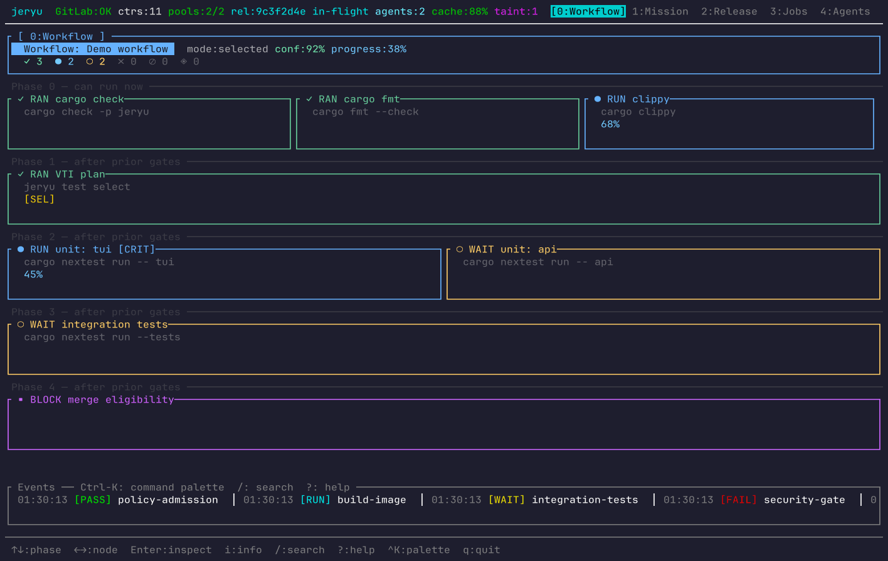

<p align="center">
  
</p>

<div align="left">
  <p>
    <a href="agent/repo-score.md">
      
    </a>
    <a href="https://github.com/neverhuman/jeryu/actions/workflows/rust.yml">
      
    </a>
    
    
  </p>
  <h3>The Git-Compatible Version Control Layer for the AI Era</h3>
</div>

---

**Git should remain familiar. Agent work should become accountable.**

`JeRyu` is a single-binary Rust control plane that wraps Git first, then adds agent-aware CI/CD tooling, smart test selection, runner orchestration, and remote server management. It is designed to be the foundational layer where autonomous software work meets deterministic human governance.

[**Full Mission**](docs/MISSION.md) · [**Installation Guide**](docs/INSTALL.md) · [**API Reference**](docs/API.md) · [**TUI Documentation**](docs/JERYU_TUI.md) · [**VTI & Smart Testing**](docs/VTI.md)

---

## 🚀 Mission Control in Your Terminal

JeRyu isn't just a headless orchestrator. It comes with a blazing-fast, proof-rich Terminal UI that serves as your mission control for agent activity.



Visualize live pipeline execution, monitor remote runner pools, inspect test bottlenecks, and review agent capabilities—all in one place without digging through raw, disconnected logs.

**10 operational tabs**: Mission · Release · Jobs · Agents · Tests · Pools · Cache · Evidence · Secrets · LLMs

```bash
# Launch the interactive TUI
jeryu tui

# Render a single diagnostic frame (for CI smoke tests)
jeryu tui --once

# Capture a deterministic PNG screenshot of any tab
jeryu tui --capture --tab mission --output mission.png
```

---

## 🛑 The Problem: Flaky, Unaccountable Automation

Modern CI pipelines and selective testing are brittle. When autonomous agents start writing code, traditional CI struggles:

- **Obsolete Work:** Superseded pipelines keep running after newer agent commits make them irrelevant.
- **Opaque Evidence:** Logs rarely explain *why* work ran, skipped, or failed.
- **Ambient Authority:** Approval, secrets, and credentials were designed for humans, not scoped agents.
- **Wasted Time:** Flaky tests and monolithic test runs waste precious compute and local agent time.

## 🟢 The JeRyu Solution

JeRyu bridges the gap between public developer pain and agent-native version control.

- **Git-Compatible:** Existing remotes (`origin`) survive installation. Muscle memory stays intact.
- **Agent-Native:** Captures and governs every agent action, providing structured evidence for everything.
- **Risk & Confidence Gates:** Enforces least-privilege policy for deploys, remote access, and destructive actions.
- **Explainable Testing:** Skips unnecessary tests conservatively using deterministic impact graphs and proof receipts.

---

## ✨ Core Capabilities

### 1. Agent-Native Git Wrapper
Intercepts and records agent Git commands into durable local state. Future actions are attributable, recoverable, and perfectly synced with the JeRyu state engine.

```bash
# All standard git commands work through jeryu
jeryu git status
jeryu git log --oneline -5

# Simplified wrappers for common workflows
jeryu save "fix: resolve race condition in pool drain"
jeryu sync     # pull --rebase + push
jeryu undo     # reset HEAD~1 --soft
```

### 2. VTI & Smart Test Selection
Maps your changes to the smallest conservative validation plan. Uses SmartCache and distributed runners so your agents avoid wasting time on unnecessary work, without sacrificing trust.

```bash
# Compute the optimal test plan for your changes
jeryu test select --base origin/main --head HEAD --explain

# Run tests through the CI pipeline
jeryu test run --command "cargo test --lib" --project-id 2

# See what the plan would look like without running
jeryu test plan --command "cargo test --lib"

# Audit VTI accuracy over time
jeryu test audit --changed src/pool.rs --all-tests unit,integration
```

### 3. Zero-Friction Remote Provisioning
Need a bigger machine for your agents? Point JeRyu at a Linux host over SSH and get a fully configured remote execution surface instantly—without turning setup into an infrastructure project. [**See full SSH Install details below ↓**](#-ssh-remote-install)

### 4. Seamless MCP Integration
Operate via CLI, TUI, or the **Model Context Protocol (MCP)**. All surfaces share the same exact policy model, grants, evidence records, and action registry, ensuring that agents and humans play by the same rules. [**See MCP details below ↓**](#-model-context-protocol-mcp)

### 5. Release & Secrets Lifecycle
End-to-end release management with canary promotion, production gates, Vault-backed secret rotation, and structured release evidence.

```bash
jeryu release status --ref-name main
jeryu release doctor --version 1.2.0
jeryu secrets rotate --version 1.2.0 --target production
```

### 6. Runner Pool Orchestration
Manage GitLab runner pools with fine-grained controls for scaling, pausing, draining, and token rotation.

```bash
jeryu pool list
jeryu pool scale default 4
jeryu pool pause build
jeryu pool drain untrusted
```

---

## 🛠️ Installation

JeRyu stays in user space by default and won't touch your shell startup files without permission.

### Prerequisites

| Requirement | Notes |
|-------------|-------|
| **Rust toolchain** | `rustup` with stable channel |
| **Docker** | Required for runner pools, GitLab, and Vault |
| **Git** | System git (`git --version` ≥ 2.30) |
| **SSH** | Required for remote provisioning (`ssh`, `ssh-keygen`) |

### Quick Install (Day 1)

Clone, build, and install JeRyu into user space:

```bash
git clone https://github.com/neverhuman/jeryu.git
cd JeRyu

# Preview the install plan without making changes
cargo run -p jeryu -- install --dry-run --yes

# Install safely in user-space (~/.jeryu/bin/jeryu)
cargo run -p jeryu -- install --yes
```

The installer:
1. Copies the compiled `jeryu` binary to `~/.jeryu/bin/jeryu`
2. Verifies the installed binary responds to `--version`
3. Prints shell-specific `PATH` advice if `~/.jeryu/bin` isn't on your `PATH`
4. Never modifies shell startup files unless you explicitly opt in with `--path-mode update`

### Install Options

| Flag | Default | Description |
|------|---------|-------------|
| `--prefix <path>` | `~/.jeryu/bin` | Installation directory |
| `--dry-run` | `false` | Preview changes without executing |
| `--yes` | `false` | Skip interactive confirmation prompts |
| `--json` | `false` | Machine-readable JSON output |
| `--color` | `auto` | Color mode: `auto`, `always`, `never` |
| `--interactive` | `auto` | Interactive mode: `auto`, `always`, `never` |
| `--path-mode` | `advise` | PATH handling: `advise`, `update`, `skip` |
| `--install-deps` | `false` | Attempt to install missing dependencies |
| `--allow-sudo` | `false` | Allow sudo for dependency installation |
| `--verbose` | `false` | Extended diagnostic output |

### Server Bootstrap

For a full server deployment with GitLab, runners, and Vault:

```bash
# Bootstrap the complete control plane
jeryu install server

# With automatic Docker installation (Linux only)
jeryu install server --install-deps --allow-sudo
```

This runs `jeryu init` which bootstraps: secrets → Docker Compose → GitLab CE → state database → runner pools → smoke tests.

### Validation & Troubleshooting

```bash
# Run the install doctor to verify system health
jeryu install doctor

# Run a smoke test in a throwaway prefix
jeryu install smoke --dry-run

# Check full system status
jeryu system
```

### Uninstall

```bash
jeryu install uninstall
```

This removes the installed binary cleanly. Your Git repositories, SSH keys, and shell configuration are never touched.

---

## 🌐 SSH Remote Install

Remote provisioning is a first-class feature of JeRyu. It allows you to turn any Linux machine with SSH access into a managed JeRyu execution node—complete with binary deployment, service management, and SSH tunneling for local API access.

### How It Works

```
┌──────────────────┐           SSH            ┌──────────────────────┐
│   Local Machine   │ ───────────────────────► │   Remote Linux Host  │
│                   │                          │                      │
│  jeryu CLI / TUI  │    Binary upload via     │  ~/.jeryu/bin/jeryu  │
│  SSH tunnel (:8929)│◄── SSH port forward ──► │  jeryu serve         │
│  MCP adapter      │                          │  Runner pools        │
│                   │                          │  GitLab + Vault      │
└──────────────────┘                          └──────────────────────┘
```

### Quick Start

```bash
# Provision a remote host in one command
jeryu remote install user@my-server.example.com \
  --alias my-server \
  --setup-key \
  --yes

# With explicit SSH key and manual service mode
jeryu remote install user@10.0.1.50 \
  --alias gpu-runner \
  --setup-key \
  --identity ~/.ssh/id_ed25519 \
  --service-mode manual \
  --verbose
```

### What the Installer Does

The `jeryu remote install` command executes a multi-step provisioning plan:

| Step | Action | Description |
|------|--------|-------------|
| 1 | **Prerequisites check** | Verifies local `ssh` and `ssh-keygen` exist |
| 2 | **Remote probe** | Checks remote OS, Docker availability, and systemd user support |
| 3 | **SSH key setup** | Generates a dedicated ed25519 keypair and injects it (when `--setup-key`) |
| 4 | **Binary upload** | Streams the local `jeryu` binary to `~/.jeryu/bin/jeryu` on the remote |
| 5 | **Version verification** | Runs `~/.jeryu/bin/jeryu --version` on the remote to confirm execution |
| 6 | **Service configuration** | Enables a systemd user unit (or prints manual guidance) |
| 7 | **Metadata persistence** | Saves remote connection details to `~/.jeryu/remotes/<alias>.toml` |

### Dry-Run & JSON Output

Always preview before mutating a remote machine:

```bash
# See the full plan without touching the remote
jeryu remote install user@my-server --dry-run --json

# Output:
# {
#   "action": "remote-install",
#   "steps": [
#     { "id": "prerequisites", ... },
#     { "id": "upload", ... },
#     { "id": "verify", ... },
#     { "id": "service", ... }
#   ]
# }
```

### Day-Two Operations

Once a remote host is provisioned, JeRyu provides a complete management surface:

```bash
# Check remote health
jeryu remote doctor my-server

# View service status
jeryu remote status my-server

# Tail remote logs
jeryu remote logs my-server

# Update the remote binary to the latest local build
jeryu remote update my-server

# Service lifecycle
jeryu remote start my-server
jeryu remote stop my-server
jeryu remote restart my-server

# Run arbitrary commands on the remote
jeryu remote run my-server -- --version
jeryu remote run my-server -- serve

# Open an interactive SSH session
jeryu remote ssh my-server

# Remove the remote installation
jeryu remote uninstall my-server
```

### SSH Tunneling

Establish secure port forwards to access the remote JeRyu API, GitLab, and Vault from your local machine:

```bash
# Open the standard SSH tunnel
jeryu remote tunnel my-server
```

This forwards the following ports over SSH:

| Local Port | Remote Service | Purpose |
|------------|---------------|---------|
| `8929` | GitLab HTTP | API access, webhook receiver |
| `2224` | GitLab SSH | Git clone/push over SSH |
| `18200` | Vault | Secret management |
| `9777` | JeRyu Webhook | Engine API and health checks |

With the tunnel active, you can use the local TUI, CLI, and MCP adapter as if the remote server were running locally:

```bash
# TUI connects through the tunnel transparently
jeryu tui

# Query the remote API
curl http://127.0.0.1:8929/api/v4/version

# Check webhook health
curl http://127.0.0.1:9777/health
```

### Remote Configuration

Each provisioned remote is stored as a TOML file in `~/.jeryu/remotes/`:

```toml
# ~/.jeryu/remotes/my-server.toml
alias = "my-server"
target = "user@my-server.example.com"
ssh_port = 22
identity = "/home/you/.ssh/jeryu_my-server_ed25519"
remote_prefix = "~/.jeryu"
remote_bin = "~/.jeryu/bin/jeryu"
local_http_port = 8929
local_ssh_port = 2224
local_vault_port = 18200
local_webhook_port = 9777
created_at_utc = "2026-05-07T03:00:00Z"
service_mode = "User"
```

### CI Integration

The SSH install is fully tested in CI via a Docker-in-Docker setup. The integration test:

1. Builds a Docker container with `sshd` and Docker daemon
2. Pre-seeds an SSH key for automated access
3. Runs a real `jeryu remote install` against the container
4. Starts the remote server and establishes an SSH tunnel
5. Queries the API through the tunnel to prove connectivity
6. Runs the local TUI to verify end-to-end communication

See [`ops/ci/ssh_install_integration.sh`](ops/ci/ssh_install_integration.sh) for the full test harness.

---

## 🤖 Model Context Protocol (MCP)

JeRyu implements the [Model Context Protocol](https://modelcontextprotocol.io) (`2025-11-25` spec), providing a standardized interface for AI coding agents to interact with the full JeRyu capability surface.

### Transports

| Transport | Command | Bind |
|-----------|---------|------|
| **Stdio** | `jeryu mcp serve` | stdin/stdout JSON-RPC |
| **Streamable HTTP** | `jeryu mcp serve-http` | `127.0.0.1:9778` (configurable) |

### Available Tools

Every MCP tool maps directly to a capability in the [Action Registry](#action-registry), ensuring identical policy, grants, and evidence handling across all surfaces.

```bash
# Print the full MCP tool manifest
jeryu mcp tools --json
```

| Tool | Description | Read-Only |
|------|-------------|-----------|
| `jeryu.fetch_capsule` | Fetch the latest structured failure capsule for a job | ✅ |
| `jeryu.get_system_snapshot` | Get a full system state summary | ✅ |
| `jeryu.get_pipeline_jobs` | Fetch the downstream-expanded job list for a pipeline | ✅ |
| `jeryu.get_ci_bottlenecks` | Return historical CI bottlenecks | ✅ |
| `jeryu.explain_blockers` | Explain why a job, release, or merge is blocked | ✅ |
| `jeryu.plan_validation` | Validate a test plan against selector-miss history | ✅ |
| `jeryu.run_tests` | Create an ephemeral branch and trigger CI | ❌ |
| `jeryu.propose_patch` | Create a branch, apply a patch, and open an MR | ❌ |
| `jeryu.race_patches` | Launch multiple patch hypotheses, keep first green | ❌ |
| `jeryu.request_merge` | Evaluate an MR through the risk gate | ❌ |

### IDE Integration

Configure JeRyu as an MCP server in your IDE or agent framework:

```json
{
  "mcpServers": {
    "jeryu": {
      "command": "jeryu",
      "args": ["mcp", "serve"],
      "env": {}
    }
  }
}
```

For HTTP-based clients:

```bash
# Start the HTTP MCP server
jeryu mcp serve-http

# The server binds to 127.0.0.1:9778 by default
# Configure in ~/.jeryu/settings.json → mcp.bind
```

### Security Model

- The MCP adapter is a **thin transport layer** over the existing capability policy engine
- HTTP transport is **loopback-only** and rejects non-local `Origin` headers
- Mutating tools (`propose_patch`, `run_tests`, `request_merge`) go through the same **capability grants** and **risk gates** as direct CLI usage
- Every action produces **durable evidence** in the state database
- Session attribution uses ephemeral `Mcp-Session-Id` values

---

## 📡 API & Webhook Server

JeRyu exposes an HTTP API for webhook ingestion and operational queries:

| Endpoint | Method | Auth | Purpose |
|----------|--------|------|---------|
| `/health` | `GET` | None | Health check (`ok`) |
| `/hooks` | `POST` | `X-Gitlab-Token` | GitLab webhook ingestion |
| `/cache/summary` | `GET` | None | Cache metrics JSON |

The webhook server processes GitLab events (Job, Pipeline, Push, Merge Request) to drive supersedence, impact analysis, VTI planning, and release orchestration.

### Capability API (Unix Socket)

For local supervised agents, JeRyu provides a Unix domain socket API:

```bash
# Start the capability server
jeryu capability serve /tmp/jeryu-capability.sock
```

Agents send JSON intents and receive structured responses:

```json
{"intent": "FetchCapsule", "payload": {"job_id": 14445}}
{"intent": "RunTests", "payload": {"project_id": 2, "target_ref": "main", "test_scope": "unit"}}
{"intent": "GetSystemSnapshot"}
```

See the full [API Reference](docs/API.md) for complete documentation of all 11 API surfaces.

---

## 🏗️ Architecture & Principles

- **Rust-First**: State transitions, orchestration, and policy are written in strongly-typed, memory-safe Rust. Shell scripts are avoided where possible.
- **Local-First, Distributed-Ready**: A laptop is enough to start. When you need it, remote runners integrate naturally.
- **Evidence Over Logs**: We prioritize structured evidence capsules over raw text logs, so agents can parse, diagnose, and recover from failures autonomously.
- **Single Policy Model**: CLI, TUI, MCP, and Capability API all share the same action registry, risk gates, and grant system.

> *If a feature makes the system faster but harder to explain, govern, recover, or trust, it is the wrong optimization.*

### Action Registry

Every JeRyu action is registered with explicit risk tiers and surface availability:

| Risk Tier | Color | Examples |
|-----------|-------|----------|
| **ReadOnly** | 🟢 | System snapshot, explain blockers, plan validation |
| **Low** | 🟡 | Retry job, run tests, pause/resume pool |
| **High** | 🟠 | Propose patch, race patches |
| **Production** | 🔴 | Request merge, promote production |

```bash
# List all registered actions with risk tiers
jeryu action list --json
```

---

## 📊 Default Port Map

| Port | Service | Notes |
|------|---------|-------|
| `8929` | GitLab HTTP | Configurable via `settings.gitlab.http_port` |
| `2224` | GitLab SSH | Configurable via `settings.gitlab.ssh_port` |
| `9777` | JeRyu Webhook/API | Configurable via `settings.webhook.bind` |
| `9778` | MCP HTTP | Configurable via `settings.mcp.bind` |
| `18200` | Vault | Configurable via `settings.vault.http_port` |
| `15432` | RedlineDB | State database |
| `19800` | SmartCache proxy | Crates.io singleflight proxy |
| `19801` | OCI registry mirror | Local container image cache |

All ports are configurable through `~/.jeryu/settings.json`.

---

## 🔧 Configuration

JeRyu uses a single JSON settings file at `~/.jeryu/settings.json`. Created with sensible defaults on first run. Unknown keys are ignored for forward compatibility; missing keys use defaults for backward compatibility.

```bash
# Reset settings to defaults
jeryu settings reset

# Validate and repair settings
jeryu settings repair
```

See the [API Reference → Settings](docs/API.md#11-settings-api) for the full schema.

---

## 🔍 Validation & Troubleshooting

JeRyu is deeply inspectable. You can always run local doctor checks to verify system health:

```bash
# Local install health
jeryu install doctor --json

# Remote node health
jeryu remote doctor my-server --json

# Full system status
jeryu system

# Host-level diagnostics
jeryu host doctor --json

# Cache health
jeryu cache doctor

# Release diagnostics
jeryu release doctor

# What should I do next?
jeryu next
```

---

## 📚 Documentation

| Document | Description |
|----------|-------------|
| [MISSION.md](docs/MISSION.md) | Product vision and strategic direction |
| [API.md](docs/API.md) | Complete 11-surface API reference |
| [JERYU_TUI.md](docs/JERYU_TUI.md) | Terminal UI documentation and tab guide |
| [VTI.md](docs/VTI.md) | Smart test selection and impact analysis |
| [INSTALL.md](docs/INSTALL.md) | Detailed installation guide |
| [testing.md](docs/testing.md) | Testing strategy and proof lanes |
| [release.md](docs/release.md) | Release lifecycle and canary promotion |
| [boundaries.md](docs/boundaries.md) | Architectural boundaries and cell catalog |
| [CONTRIBUTING.md](CONTRIBUTING.md) | Contributor guidelines |
| [SECURITY.md](SECURITY.md) | Security policy and vulnerability reporting |

---

## 📄 License

MIT — see [LICENSE](LICENSE) for details.
