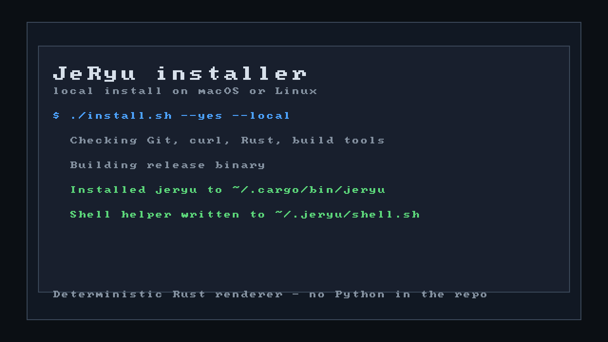

<p align="center">
  
</p>

<div align="center">
  <pre>
      __     ___
   _ / /___ / _ \__ __ __ __
  // // -_) |   / // // // /
 \___/\__/__|_\_\_, / \_,_/
               /___/
  </pre>
  <h3>The Git-Compatible Version Control Layer for the AI Era</h3>
</div>

---

`JeRyu` is a single-binary Rust control plane that wraps Git first, then adds agent-aware CI/CD tooling, smart test selection, runner orchestration, and remote server management.



Full install guide: [`docs/INSTALL.md`](docs/INSTALL.md)

## Local install

```bash
git clone https://github.com/jeppsontaylor/JeRyu.git
cd JeRyu
cargo run -p jeryu -- install --yes
```

Useful modes:

```bash
cargo run -p jeryu -- install --color always --interactive always --path-mode advise
cargo run -p jeryu -- install server --yes
cargo run -p jeryu -- install --dry-run --yes --prefix ~/.jeryu/bin
cargo run -p jeryu -- install doctor --json
```

The installer:

- installs the currently running `jeryu` binary into `~/.jeryu/bin/jeryu` by default;
- verifies `jeryu --version` after the atomic replacement;
- stays in user space unless you explicitly ask for `--install-deps --allow-sudo` on the server path;
- does not touch shell startup files;
- can run `jeryu init` on the server path after Docker checks pass.

## Remote SSH server

The remote manager provisions a Linux host over SSH and stores metadata in `~/.jeryu/remotes/<alias>.toml`.

```bash
cargo run -p jeryu -- remote install xbabe1 --alias xbabe1 --setup-key --yes
```

That example:

1. creates a dedicated `~/.ssh/jeryu_xbabe1_ed25519` key when requested;
2. installs the public key on the remote host;
3. uploads the current `jeryu` binary to `~/.jeryu/bin/jeryu`;
4. verifies `jeryu --version` on the remote host;
5. runs `jeryu init` on the remote host during install;
6. writes `~/.jeryu/remotes/xbabe1.toml`;
7. enables the remote `jeryu.service` user unit when systemd is available.

Day-two commands:

```bash
cargo run -p jeryu -- remote status xbabe1
cargo run -p jeryu -- remote logs xbabe1
cargo run -p jeryu -- remote ssh xbabe1
cargo run -p jeryu -- remote run xbabe1 -- system
cargo run -p jeryu -- remote tunnel xbabe1
```

Remote service modes:

- `auto` uses systemd user units when available;
- `user` requires systemd user support;
- `manual` keeps the host in binary-only mode and prints `serve` guidance.

Tunnel ports:

| Local | Remote |
| --- | --- |
| `127.0.0.1:8929` | GitLab HTTP |
| `127.0.0.1:2224` | GitLab SSH |
| `127.0.0.1:18200` | Vault |
| `127.0.0.1:9777` | JeRyu webhook listener |

## Demo GIF

The README demo asset is generated by Rust, not Python:

```bash
cargo run -p jeryu -- install render-demo --output assets/install-demo.gif
```

If you also want a PNG snapshot:

```bash
cargo run -p jeryu -- install render-demo --output assets/install-demo.gif --png assets/install-demo.png
```

## Validation

Run the installer and remote-manager checks:

```bash
cargo run -p jeryu -- install --dry-run --json
cargo run -p jeryu -- install smoke --dry-run
cargo run -p jeryu -- remote install xbabe1 --dry-run --yes --setup-key
```

This keeps the install surface in Rust, exercises the dry-run plans, and renders the deterministic demo GIF.

## Troubleshooting

If the remote helper cannot reach the host, check the SSH target first:

```bash
ssh xbabe1
```

If Docker is missing on the remote host, rerun the remote install with Docker enabled or install Docker manually on that machine.
