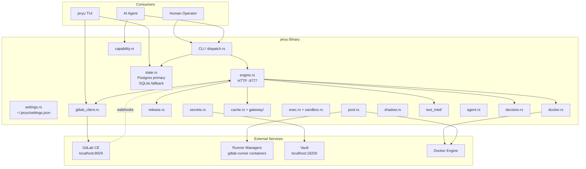
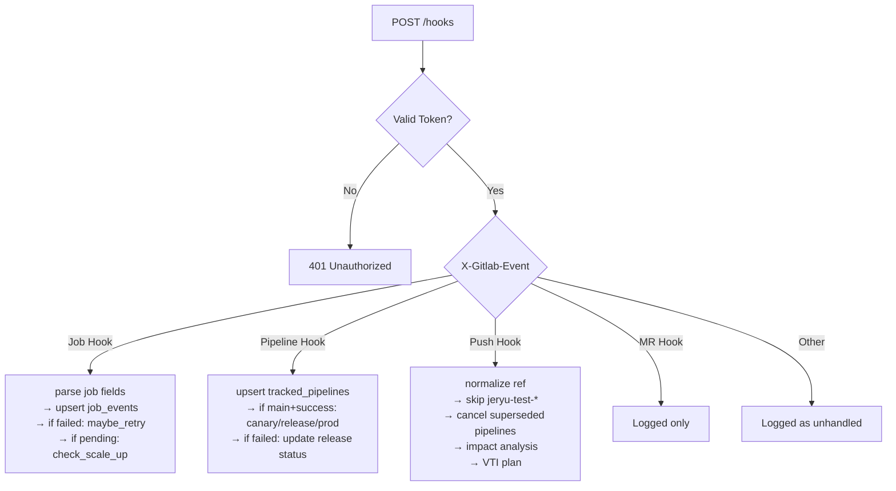
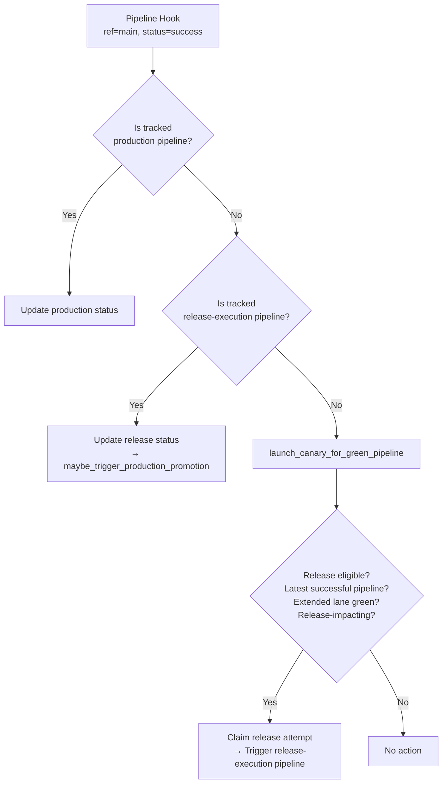
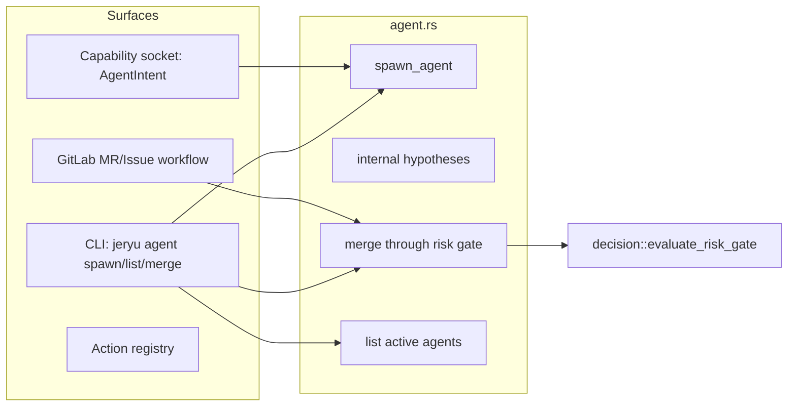
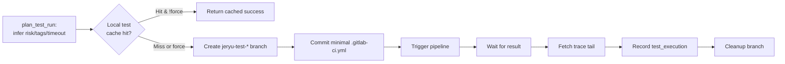
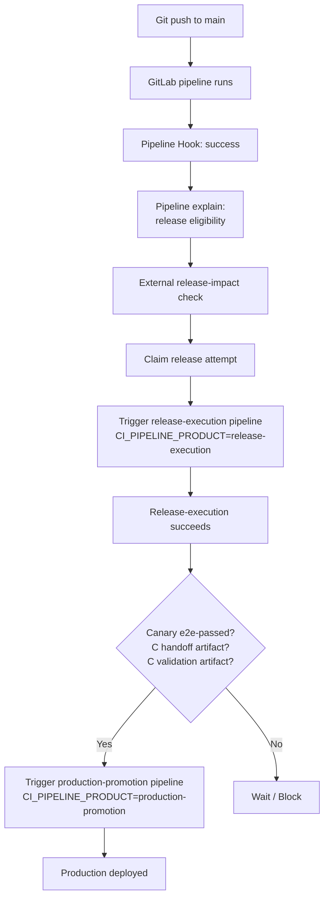

# ARCHITECTURE.md — JeRyu / jeryu System Architecture

> Version: 5.0.0
> Last updated: 2026-04-26
> Scope: `/home/ubuntu/JeRyu` single-binary Rust control plane plus workspace crates.
> Audience: External agents, reviewers, and contributors requiring full system context.

`jeryu` is a Rust control plane that turns a local GitLab instance, GitLab Runner, Docker, Vault, Postgres/SQLite state, and repo-local CI semantics into an agent-operable delivery system. It owns runner fleet state, webhook reconciliation, custom executor policy, release/canary/prod automation, SmartCache, VTI smart test selection, Vault-backed release secrets, failure evidence, action registry, settings management, and a Ratatui supervisory TUI.

Companion references:
- **API surface**: `docs/API.md`
- **VTI smart test system**: `docs/VTI.md`
- **TUI details**: `docs/JERYU_TUI.md`
- **CI testing**: `docs/ci-testing.md`
- **RTK shell helper**: `docs/RTK.md`

---

## 1. Architectural Thesis

The system is built around five control planes:

| Plane | Responsibility | Primary modules |
| --- | --- | --- |
| Interface plane | CLI, TUI, hooks, capability socket, MCP adapter, action registry | `cli.rs`, `dispatch.rs`, `tui/`, `capability.rs`, `mcp.rs`, `admission.rs`, `exec.rs` |
| Control plane | Webhook ingestion, reconciliation, runner scaling, release triggers | `engine.rs`, `pool.rs`, `release.rs`, `shadow.rs` |
| State plane | Durable source of truth and audit ledgers | `state.rs`, `settings.rs` |
| Execution plane | GitLab Runner managers, custom executor, sandbox, tripwires, cache decisions | `exec.rs`, `sandbox.rs`, `honeypot.rs`, `cache_brain.rs`, `taint.rs`, `witness.rs`, `buildkit.rs` |
| Intelligence plane | Agent operations, risk gates, impact/VTI planning, failure classification, next-action recommendation | `agent.rs`, `decision.rs`, `impact.rs`, `test_intel/`, `capsule.rs`, `test_runner.rs`, `explain.rs` |

Agents are expected to operate through typed commands, GitLab MRs/pipelines, capability intents, or documented hooks. Production deployment is intentionally mediated by GitLab pipelines and release gates, not ad hoc shell commands.

---

## 2. Git Compatibility Layer & Dual-Use Pipeline

JeRyu introduces a phased migration model from standard Git to AI-driven version control:

1. **Passthrough Layer (`jeryu git <args>`)**: JeRyu wraps the system Git binary seamlessly. This allows users to alias `git="jeryu git"` without breaking muscle memory or tooling.
2. **Native Wrappers (`jeryu status`, `jeryu save`, `jeryu undo`)**: Higher-level CLI commands that combine multiple Git operations or add AI context (e.g. `save` runs `add` + `commit`).
3. **Dual-Use Remote Sync (`jeryu ship`)**: Designed for environments operating both locally (shadow pipeline) and remotely (e.g. GitHub/GitLab LAN). `jeryu ship` pushes the commit to the primary `origin` remote, then also promotes the commit to a repo-local headless `shadow` remote, triggering instant CI validation locally while preserving the remote state.

---

## 3. System Topology



---

## 3. Crate and Module Map

The workspace is defined in `Cargo.toml` with members:

```
.                   # jeryu (main binary)
crates/cargo-witness
crates/witness-rt
crates/cargo-vrc
crates/cargo-aer
crates/arc-bench
```

### 3.1 jeryu Module Map

The crate root (`src/lib.rs`) exports these modules:

| Module | Capability |
| --- | --- |
| `admission` | Git server pre-receive hook installation and enforcement. |
| `agent` | Autonomous agent branch/MR/task workflow and risk-gated merge. |
| `agent_surface` | Generated agent routing index and surface audit. |
| `bootstrap` | First-run environment, GitLab, DB, runners, and smoke setup. |
| `install` | Guided local installer, path management, and verification. |
| `buildkit` | Per-trust/namespace BuildKit configuration. |
| `cache` | SmartCache supervisor, status, doctor, GC, host doctor. |
| `cache_brain` | Build-unit cache decisions using epoch, taint, trust, witness data. |
| `cache_proxy` | sccache-related TCP proxy and coordination. |
| `capability` | Unix-socket JSON AgentIntent server for supervised agents. |
| `capsule` | Failure capsule format and classification helpers. |
| `config` | Paths, ports, default pools, compose templates, runner config templates. |
| `decision` | Supersedence, impact lanes, retry decisions, trust tiers, risk gates. |
| `docker` | Docker API control over GitLab, managers, events, logs. |
| `engine` | Webhook server, reconciliation loop, Docker event loop, disk sentinel. |
| `epoch` | Cache epoch invalidation. |
| `exec` | GitLab Runner custom executor driver. |
| `explain` | Explanation helpers for pipeline and blocker analysis. |
| `gateway` | Cache gateway protocol proxies (submodules below). |
| `gitlab_client` | GitLab REST API wrapper. |
| `honeypot` | Tripwire/honeypot token seeding and watching. |
| `impact` | Semantic impact planning for pushes. |
| `logs` | Manager/job log printing helpers. |
| `policy` | Trust-tier policy primitives. |
| `pool` | Runner pool scaling, pause/resume, drain, deletion, token rotation. |
| `reclaim` | Storage audit, aggressive reclaim, auto-GC. |
| `release` | Pipeline explain/doctor/progress/preflight, canary, release, prod promotion. |
| `remote` | Remote SSH install, service management, and remote day-two operations. |
| `sandbox` | Strict executor sandbox configuration. |
| `sccache_mgr` | sccache management for CI jobs. |
| `secrets` | Vault init/status, release secret rotation/finalization/recovery. |
| `settings` | User-facing `~/.jeryu/settings.json` — all tunables in a typed schema. |
| `shadow` | Shadow sync loop and repo-local shadow remote controls. |
| `state` | Postgres-primary schema, migrations, query API, SQLite fallback. |
| `taint` | Cache taint/quarantine manager. |
| `telemetry` | Telemetry helpers. |
| `test_intel` | VTI smart test selection, testmap support, audit/learn/cache plan. |
| `test_runner` | Dynamic CI test runner and batch test runner. |
| `tui` | Ratatui dashboard (submodules below). |
| `witness` | Build witness/signature creation. |

### 3.2 Gateway Submodules

`src/gateway/` provides protocol-specific cache proxying:

| Submodule | Protocol |
| --- | --- |
| `cargo` | Crates.io sparse index / download proxy |
| `git` | Git object caching |
| `npm` | npm registry proxy |
| `oci` | OCI / Docker registry mirror |
| `singleflight` | Request coalescing across concurrent builds |

### 3.3 TUI Submodules

`src/tui/` provides the terminal dashboard:

| Submodule | Purpose |
| --- | --- |
| `mod.rs` | TUI entry point, run loop, keyboard handling |
| `app.rs` | Application state, background data sync, snapshot hydration |
| `ui.rs` | All rendering code — tabs, layouts, widgets |
| `action_registry.rs` | Single source of truth for all jeryu actions with risk tiers |
| `graph.rs` | DAG graph layout utilities for flow visualization |
| `events.rs` | Terminal event types |
| `flow/` | Flow Board pipeline visualization subsystem |

### 3.4 TUI Flow Submodules

`src/tui/flow/` provides the release flow pipeline visualization:

| Submodule | Purpose |
| --- | --- |
| `mod.rs` | Flow module root and exports |
| `model.rs` | `FlowGraph`, `FlowNode`, `FlowEdge` — the typed pipeline DAG |
| `builder.rs` | Converts raw GitLab job/pipeline data into a `FlowGraph` |
| `collector.rs` | Background collector polling GitLab for live pipeline data |
| `widget.rs` | `FlowGraphWidget` — left-to-right pipeline visualization |
| `inspector.rs` | Job inspector overlay with detailed job metrics |
| `eta.rs` | ETA/progress estimation from historical data |

### 3.5 Test Intel Submodules

`src/test_intel/` implements the VTI (Jeryu Test Intelligence) system:

| Submodule | Purpose |
| --- | --- |
| `planner.rs` | Internal planner — subsystem-based test selection for JeRyu |
| `testmap.rs` | External planner — `.jeryu/testmap.toml` based selection for dougx |
| `subsystem.rs` | Subsystem ownership graph, glob matching, global invalidators |
| `ci_gen.rs` | GitLab child pipeline YAML emission |
| `explain.rs` | Human-readable plan explanation rendering |
| `cache.rs` | Deterministic test cache key computation |
| `nightly.rs` | Nightly oracle — selector audit, learning, miss persistence |

Full VTI documentation: `docs/VTI.md`

### 3.6 Workspace Crates (Proof-Scoped Control Plane)

| Crate | Purpose |
| --- | --- |
| `cargo-witness` | Build witness graph of pub API signatures; diff classifies changes; diagnose routes compile errors. |
| `cargo-vrc` | Generate `agent-map.json` + `test-map.json`; plan selects minimal test set by dep graph. |
| `cargo-aer` | Audit for mega-files, structural exceptions; manage `aer-records/`. |
| `witness-rt` | `agent_ensure!`, `agent_bail!`, `agent_expect!` macros + panic hook for structured repair packets. |
| `arc-bench` | Benchmark ARC/VRC design tradeoffs. |

---

## 4. Settings Architecture

`settings.rs` manages `~/.jeryu/settings.json` — a typed, forward/backward-compatible configuration file. Creates with defaults on first run. Unknown keys are ignored; missing keys use defaults.

| Section | Key fields |
| --- | --- |
| `gitlab` | `image`, `runner_image`, `hostname`, `http_port`, `ssh_port` |
| `vault` | `image`, `container_name`, `http_port`, `mount`, `prefix` |
| `webhook` | `bind` (default `127.0.0.1:9777`) |
| `cache` | `proxy_port`, `registry_port`, `manager_budget_gib` |
| `sccache` | `enabled`, `cache_size`, `binary_version` |
| `release` | `repo_root`, `default_project_id` |
| `shadow` | `upstream_url` |
| `sandbox` | `strict_network_isolation` |
| `tui` | `sync_interval_ms`, `recent_jobs_limit`, `recent_evidence_limit`, `audit_events_limit` |

The settings are loaded once at startup via `settings::init()` and accessible process-wide via `settings::get()`.

---

## 5. Bootstrapping Lifecycle

`jeryu init` is the expected first-run path. It builds a self-contained local system:

1. Generate or preserve jeryu secrets (`jeryu.env`).
2. Render `docker-compose.yml` from templates.
3. Start GitLab CE and Vault containers.
4. Wait for GitLab readiness.
5. Create a root PAT.
6. Open/migrate the configured state database.
7. Register default runner pools (`default`, `build`, `untrusted`).
8. Render runner configs.
9. Start smoke project/pipeline.

The bootstrap output becomes the basis for `jeryu serve`.

---

## 6. Serve Lifecycle

`jeryu serve` starts the long-running control plane:

```mermaid
flowchart LR
    A[Load client + webhook secret] --> B[Open state DB]
    B --> C[Connect Docker]
    C --> D[docker compose up]
    D --> E[Install global pre-receive hook]
    E --> F[Start SmartCache supervisor]
    F --> G[Scale unpaused pools to min_warm]
    G --> H[Spawn engine HTTP server]
    H --> I[Spawn shadow sync loop]
    I --> J[Wait for Ctrl-C]
```



The engine itself starts concurrently:
- Axum HTTP server on `:9777`
- 300s reconciliation loop
- Docker event stream listener
- Disk pressure / GC sentinel loop

---

## 7. Engine Architecture

`engine.rs` is the real-time orchestrator. It owns:

- `GET /health`, `POST /hooks`, `GET /cache/summary`
- Pool reconciliation
- Docker crash/OOM recovery
- Disk pressure response
- Job-event scale-up and failure auto-retry
- Pipeline supersedence
- Push impact planning and VTI plan recording
- Canary launch and release/prod pipeline status tracking
- Automatic production promotion checks

### 7.1 Webhook Authentication

GitLab webhooks must include `X-Gitlab-Token: <JERYU_WEBHOOK_SECRET>`. Invalid tokens return HTTP 401.

### 7.2 Webhook Event Flow



### 7.3 Pipeline Hook — Release Decision Tree



### 7.4 Reconciliation Loop

Every 300 seconds:

1. List pools.
2. Count pending jobs.
3. Compute target managers per pool: `min_warm + pending`, capped at `max_managers`.
4. Scale each unpaused pool to target.
5. Discover missing runner `system_id` values from manager config dirs.
6. Reconcile release state for project `2`, ref `main`.

### 7.5 Docker Event Loop

Watches container events. If a jeryu-managed manager container dies or OOMs, immediately runs reconciliation to replace capacity.

### 7.6 Disk Pressure Sentinel

Checks root disk usage every 300 seconds:

| Threshold | Action |
| --- | --- |
| < 75% | Lightweight orphan manager cache GC |
| ≥ 75% | Pressure cleanup |
| ≥ 85% | Critical cleanup |
| ≥ 93% | Emergency cleanup, may evict active manager caches |

Loops toward a 70% target watermark and records `disk_pressure_gc`, `disk_pressure_gc_complete`, and `disk_gc_stalled` events.

---

## 8. State Architecture

Postgres is the primary durable coordination layer for concurrent agent-first operation. `Db::open()` loads `~/.jeryu/jeryu.env`, selects `JERYU_DATABASE_URL` when present, runs migrations, and exposes typed query methods over a backend-neutral `sqlx::AnyPool`. Fresh bootstrap writes a local Postgres URL and Docker Compose includes a `jeryu-postgres` service on `127.0.0.1:15432`; SQLite remains the embedded fallback when no database URL is configured. State SQL passes through a backend placeholder normalizer for Postgres-bound operations so the same typed methods can run in either mode. The schema is append-friendly and stores both operational state and audit state.

For proof, `jeryu repo postgres-state-proof` launches a disposable local Postgres container and runs the core state smoke against pools, managers, job/event tracking, VTI plan records, cache verdicts, action-cache writes, epoch bumps, taint propagation, CacheBrain hit/deny decisions, capability grants, and admission decisions.

### 8.1 Table Groups

| Group | Tables |
| --- | --- |
| Runner fleet | `pools`, `managers` |
| Jobs and pipelines | `job_events`, `ci_job_runs`, `tracked_pipelines` |
| Audit ledger | `events` |
| Release | `release_attempts` |
| Failure/retry | `evidence_capsules`, `retry_decisions` |
| Shadow sync | `shadow_sync_configs` |
| Secrets | `secret_authorities`, `release_secret_sets`, `secret_audit_events` |
| Cache | `cache_objects`, `cache_requests`, `hot_cache_entries`, `build_signatures`, `image_signatures`, `force_refresh_rules`, `resolved_refs`, `cache_taints`, `cache_leases`, `cache_verdicts`, `cache_promotions`, `material_objects`, `material_aliases`, `action_cache`, `cache_epochs`, `toolchain_fingerprints` |
| Tests/VTI | `test_executions`, `test_plans`, `test_plan_items`, `selector_misses` |

### 8.2 State Invariants

- State changes go through `Db` methods — never raw SQL in callers unless the module owns a backend-neutral state helper.
- Shared SQL must avoid SQLite-only syntax; use portable `ON CONFLICT` upserts and `Db::backend()` only for unavoidable backend branches.
- Manager state machine: `starting → online → draining → stopped`, with `failed` for abnormal state.
- Event ledger rows are append-only by convention.
- Release attempts are keyed by project/ref/sha/version semantics.
- Production pipeline tracking is separate from release-execution pipeline tracking.

---

## 9. Runner Pool Architecture

Pools are logical GitLab runner groups. Each pool has: GitLab runner ID and auth token, tags, executor type (`docker`/`custom`), min/max manager count, concurrency knobs, paused state, and trust tier.

### 9.1 Default Pools

| Pool | Tags | Executor | min_warm | max_managers | Trust |
| --- | --- | --- | ---: | ---: | --- |
| `default` | `default,rust,test` | `docker` | 2 | 4 | `trusted` |
| `build` | `build,docker-build,x86-64,docker,dind` | `docker` | 2 | 4 | `privileged` |
| `untrusted` | `untrusted,sandbox,mr` | `custom` | 1 | 2 | `untrusted` |

### 9.2 Pool Operations

Managers are Docker containers running `gitlab-runner`. `pool.rs` owns: `scale_pool_to`, `pause_pool`, `resume_pool`, `drain_pool`, `delete_pool`, `rotate_pool_token`. Scaling creates config dirs under `runners/`, renders GitLab Runner config, starts containers, and records manager rows.

---

## 10. Custom Executor and Execution Security

The `untrusted` pool uses the custom executor path. GitLab Runner invokes:

```
jeryu exec config       → driver config JSON
jeryu exec prepare      → fast clone/reflink sandbox + honeypot seeding
jeryu exec run <script> <stage> → stage execution with cache brain
jeryu exec cleanup      → cleanup sandbox state
```

Execution responsibilities:
- Return driver config JSON (builds_dir, cache_dir, driver info)
- Prepare fast clone/reflink sandbox
- Seed honeypot tokens and start tripwire watchers
- Bootstrap Docker/Python tooling when needed
- Initialize DB, epoch manager, taint manager, cache brain
- Compute Docker/Rust build witnesses
- Decide exact cache hits vs cold execution
- Record cache verdicts and promotions
- Capture failure capsules
- Quarantine on tripwire evidence

The executor is a GitLab Runner protocol implementation, not a generic shell API.

---

## 11. Admission Control

`admission.rs` installs and runs a Git server pre-receive hook (`jeryu server-hook pre-receive`). The hook reads standard pre-receive input and evaluates each ref update into a versioned `allow`, `audit`, or `deny` record. Human/system refs are allowed when syntactically valid. Agent refs (`refs/heads/agent/*`, `refs/heads/agents/*`, `refs/heads/jeryu/*`) are allowed when the update matches an active capability grant in the state ledger; otherwise they are audit-only by default. `JERYU_ADMISSION_ENFORCE=1` turns missing-ledger agent writes into hook denials. The hook persists decisions in `admission_decisions` when the database is available. `jeryu serve` installs the global hook at startup. Admission control is part of the security boundary for agent-proposed changes.

---

## 12. Agent Architecture



The agent system has three layers:

| Layer | Surface |
| --- | --- |
| Human/agent CLI | `jeryu agent spawn/list/merge` |
| GitLab workflow | branches, issues, MRs, labels, pipelines |
| Capability socket | typed `AgentIntent` payloads |

Merge is guarded by `decision::evaluate_risk_gate`: untrusted tier requires escalation, failed jobs deny, pending/running jobs escalate.

---

## 13. Action Registry

`tui/action_registry.rs` is the single source of truth for all jeryu actions. Each entry has:
- `id`, `label`, `key_hint`
- `risk_tier`: `ReadOnly`, `Low`, `High`, `Production`
- `side_effect_class`: `read_only`, `local_state`, `git_write`, `ci_execution`, `merge`, `production`
- `required_grant`: `none`, `agent_task`, `merge_approval`, `production_approval`
- `surfaces`: `Cli`, `Tui`, `Capability`
- `dry_run` flag
- `description`

The registry is consumed by the TUI command palette, `jeryu action list [--json]`, and the capability API.

Key registered actions:

| Action | Risk | Surfaces | Key |
| --- | --- | --- | --- |
| `open_logs` | read-only | TUI | Enter |
| `retry_job` | low | CLI+TUI | r |
| `delete_record` | low | TUI | d |
| `pause_pool` | low | CLI+TUI | p |
| `explain_blockers` | read-only | ALL | — |
| `get_system_snapshot` | read-only | Cap+CLI | — |
| `propose_patch` | high | ALL | — |
| `race_patches` | high | Cap+CLI | — |
| `request_merge` | production | ALL | — |
| `plan_validation` | read-only | Cap+CLI | — |
| `run_tests` | low | ALL | — |
| `next_action` | read-only | CLI+TUI | — |
| `tab_mission..tab_secrets` | read-only | TUI | 1–9 |
| `toggle_audit_ledger` | read-only | TUI | a |
| `quit` | read-only | TUI | q |

---

## 14. Capability Server Architecture

`capability.rs` is a Unix domain socket JSON server. It accepts tagged `AgentIntent` payloads:

- `FetchCapsule { job_id }` — retrieve failure capsule from event ledger. **Active.**
- `RunTests { project_id, target_ref, test_scope }` — create ephemeral branch, inject dynamic CI YAML, trigger pipeline. **Active.**
- `ProposePatch { project_id, branch_name, base_ref, commit_message, modifications, mr_title }` — create an agent proposal branch and merge request. **Active; grant-required.**
- `RacePatches { project_id, target_branch, variants }` — run competing patch variants and select winner evidence. **Active; grant-required.**
- `RequestMerge { project_id, mr_iid, source_branch, target_branch }` — return a V2.0.1 merge-gate proof over selector and cache evidence. **Active but advisory until shared GitLab MR/pipeline/approval evidence is wired in.**
- `ListAllowedActions` — serialize the canonical action registry contract for agent discovery. **Active.**
- `PlanValidation { changed_paths }` — return VTI selection without running tests. **Active.**

The design goal is least-privilege agent action: agents ask for typed capabilities rather than holding broad PATs.

Successful branch-writing capability intents create durable `capability_intents` rows and 24-hour `capability_grants` rows scoped to the fully-qualified ref. GitLab commit API writes store the returned commit SHA in the grant, allowing admission to bind a ledger match to the exact post-update object when Git provides the new SHA. Admission reads this ledger before allowing enforced agent refs. The current grant records are local and unsigned; future hardening adds peer credentials, actor/task envelopes, path scopes, idempotency keys, signatures, and SHA binding for non-commit Git write paths.

`mcp.rs` is the MCP transport adapter. It exposes the same capability-backed actions through stdio JSON-RPC and Streamable HTTP using `initialize`, `notifications/initialized`, `ping`, `tools/list`, and `tools/call`. The tool list is derived from the canonical action registry, and each tool call is routed back through the same policy and evidence path used by the capability socket.

---

## 15. Decision Engine

`decision.rs` centralizes:

| Type | Values |
| --- | --- |
| `SupersedenceAction` | Cancel, Preserve, Degrade, Ignore |
| `ImpactLane` | Full, Unit, Integration, DocsOnly |
| `FailureClassification` | Infrastructure, Transient, Regression, Unknown |
| `RetryDecision` | RetryOnce, DoNotRetry, Quarantine, Escalate |
| `TrustTier` | Untrusted, Trusted, Privileged |
| `RiskGateDecision` | Allow, Deny, Escalate |

Retry recommendations: transient/infrastructure → retry once; quarantined → quarantine; regression → do not retry; unknown → escalate.

Risk gate: failed jobs deny; pending/running escalate; zero successful evidence denies when required; untrusted tier escalates even with clean evidence.

---

## 16. Failure Capsules

Failure capsules (`capsule.rs`) are structured evidence records for failed jobs. They feed: `jeryu job explain`, `jeryu explain-blocker job`, capability `FetchCapsule`, retry decision logic, and event/audit ledgers. Fields: job_id, pipeline_id, stage, ref_name, commit_sha, failure_kind, classification, exit_code, summary, log_snippet, repro_script, superseded_by_sha.

---

## 17. Test Runner Architecture

`test_runner.rs` gives agents a safe way to run specific tests through GitLab CI:



Batch mode runs several commands concurrently with a semaphore-limited `JoinSet`. The engine push hook intentionally ignores `jeryu-test-*` branches to avoid supersedence canceling scratch test pipelines.

---

## 18. VTI Smart Test Selection

`test_intel/` implements VTI — see `docs/VTI.md` for the comprehensive reference.

Summary: subsystem matching → global invalidator detection → docs-only detection → minimal test plan generation → explanation rendering → GitLab child pipeline generation → external `.jeryu/testmap.toml` support → selector audit → learning suggestions → cache key computation.

The built-in planner operates on changed paths within JeRyu. The external planner consumes `.jeryu/testmap.toml` from another workspace (currently `/home/ubuntu/dougx`). Push hooks record VTI plans into the state database for later auditing.

---

## 19. Release Architecture



### 19.1 Release Attempt State

`release_attempts` records: project/ref/sha/version, upstream pipeline id/status, release-execution pipeline id/status, production-promotion pipeline id/status, canary status/timestamps/note.

### 19.2 Canary Path

Release-execution pipeline variables: `CI_PIPELINE_PRODUCT=release-execution`, `JERYU_CANARY_APPROVED=1`, `JERYU_UPSTREAM_PIPELINE_ID`, `JERYU_RELEASE_SHA`, `JERYU_RELEASE_VERSION`, optional `JERYU_UPSTREAM_BUILD_JOB_ID`, optional `VEOX_PUBLISH_ENCLAVE_REF`.

### 19.3 Production Path

Production variables: `CI_PIPELINE_PRODUCT=production-promotion`, `JERYU_PROD_APPROVED=1`, `JERYU_RELEASE_SHA`, `JERYU_RELEASE_VERSION`. Production is pipeline-driven — ad hoc production shell commands are explicitly discouraged.

### 19.4 Release Preflight and Doctor

`release preflight` checks SSH, Vault, registry, and disk before launching canary. Returns structured pass/fail with blockers.

`release doctor` diagnoses blocking state for a specific release version — canary completeness, production completeness, gate artifacts, safe-to-reconcile status, with optional live preflight checks.

---

## 20. Secrets and Vault Architecture

`secrets.rs` manages Vault and release secret handoff:

- Initialize Vault
- Report health
- Rotate release-scoped secrets
- Render deploy/runtime envs
- Record audit events
- Finalize secret sets after promotion
- Build release reports
- Recover release bundles

Repo support is focused on `dougx`. Default release repo root: `/home/ubuntu/dougx`, overrideable with `JERYU_RELEASE_REPO_ROOT` or `settings.release.repo_root`.

Principles: track authority metadata in the state ledger; keep runtime/recovery paths in release secret-set records; write handoff reports without exposing long-lived tokens; finalize after promotion.

---

## 21. SmartCache Architecture

SmartCache includes: local proxy/gateway, local registry mirror, CAS and crate cache disk tracking, manager cache GC, singleflight request coalescing, taint/quarantine boundaries, cache verdict history, host doctor, disk pressure integration.

The cache brain combines: build unit type, input signature, environment signature, scope, trust tier, epoch manager, taint manager, witness data. This allows exact-hit skip, cold execution fallback, and promotion decisions expressed as policy.

### 21.1 Cargo Target and Sccache Layout

Cargo build reuse is split by trust boundary:

- Local agent runs use `~/.jeryu/cache/local-cargo/targets/<repo-key>/<rustc-key>/<host-triple>/target` and `~/.jeryu/cache/local-cargo/sccache`.
- Runner pools use `~/.jeryu/cache/pools/<pool>/cargo-targets/<project-slug>/<rustc-key>/<host-triple>/target` and `~/.jeryu/cache/pools/<pool>/sccache`.
- Docker and custom executors mount pool cache roots separately so untrusted, default, and build pools do not share compiled `target/` directories.
- `sccache` remains the shared reuse layer for compiler outputs; `target/` reuse is treated as a local optimization inside one repo/toolchain/host triple scope.
- GC skips active leases, which is why target directories carry a lease file alongside the build output.

### 21.2 Gateway Protocols

| Protocol | Module | Function |
| --- | --- | --- |
| Cargo / crates.io | `gateway/cargo.rs` | Sparse index and crate download singleflight proxy |
| Git objects | `gateway/git.rs` | Git object cache |
| npm | `gateway/npm.rs` | npm registry proxy |
| OCI / Docker | `gateway/oci.rs` | OCI registry mirror |
| Coalescing | `gateway/singleflight.rs` | Request deduplication across concurrent builds |

---

## 22. Taint, Honeypot, Witness, and BuildKit

| Module | Role |
| --- | --- |
| `honeypot` | Seeds sandbox honey tokens and starts tripwire watchers. |
| `taint` | Tracks cache taint/quarantine state. Append-only; purges are recorded events. |
| `witness` | Produces deterministic build witnesses for Docker/Rust builds. |
| `buildkit` | Keeps BuildKit configuration scoped by trust namespace. Never shares builder state across namespaces. |
| `sandbox` | Strict sandbox configuration. Uses unshare/bwrap for network isolation. |

These modules form the supply-chain defense boundary for untrusted/custom executor work.

---

## 23. Shadow Sync Architecture

`shadow.rs` has two capabilities:

1. **DB-backed periodic shadow sync loop** — monitors configured local source directories and pushes changes to GitLab projects/branches. Records status, SHAs, failures, upstream state. The `sync-now` command triggers sync by requesting it through the DB (`request_shadow_sync`); the shadow worker picks it up within ~2s.

2. **Repo-local remote management** (`shadow-remote`) — inspect, ensure, and push a named remote (default `shadow`).

---

## 24. TUI Architecture

The Ratatui TUI is a supervisory dashboard with 9 tabs:

| Tab | Key | Content |
| --- | --- | --- |
| Mission | 1 | System health overview |
| Release | 2 | Release gate matrix |
| Jobs | 3 | Jobs + Flow Board |
| Agents | 4 | Agent task dashboard |
| Tests | 5 | Test Intelligence |
| Pools | 6 | Runner Pools |
| Cache | 7 | SmartCache metrics |
| Evidence | 8 | Evidence & Audit ledger |
| Secrets | 9 | Vault lifecycle |

Background workers: general snapshot sync (~1500ms), flow collector (~1500ms), selected job trace polling (~650ms).

The Flow Board uses a builder → model → widget pipeline: the `collector` polls GitLab, the `builder` converts raw data into a `FlowGraph`, and the `widget` renders a left-to-right DAG visualization with job status, ETA estimates, and critical path highlighting. It retains last non-empty flow snapshots and marks them stale instead of blinking to empty state.

See `docs/JERYU_TUI.md` for full behavior.

---

## 25. Next-Action and Explain-Blocker

`jeryu next` recommends the highest-priority action for the current branch by checking (in priority order):
1. Recent job failures → suggests `jeryu job explain`
2. Active pipelines → shows status
3. Release gate state → shows release status
4. Selector misses → suggests `jeryu test audit`

`jeryu explain-blocker <entity_type> <entity_id>` diagnoses specific blockages:
- `job`: shows failure capsule (kind, classification, retry advice, log snippet, supersedence)
- `release`: shows attempt state (upstream, canary, release pipeline, production pipeline, blockers)
- `merge`: shows selector miss count, pipeline/approval guidance

---

## 26. GitLab Client Architecture

`gitlab_client.rs` is a purpose-built REST wrapper. It does not expose arbitrary GitLab API calls. Domain modules use typed methods for: readiness, runner lifecycle, jobs and traces, artifacts, webhooks, projects, repository file commits, issues, MRs, branches, pipelines, downstream bridge/job collection.

---

## 27. Docker Architecture

`docker.rs` owns Docker interactions: compose up/down, runner manager container lifecycle, managed container listing, event stream, logs. Engine and pool code use `DockerCtl` rather than shelling out.

---

## 28. Host Reclaim Architecture

`reclaim.rs` provides: storage audit, aggressive reclaim, automatic GC called by the engine under disk pressure. The engine escalates reclaim behavior based on root disk usage thresholds. Systemd timer (`ops/ci/jeryu-gc.timer`) runs GC every 6 hours.

---

## 29. Interface Separation

`src/cli.rs` is pure clap definitions. `src/dispatch.rs` wires commands to modules. Business logic should not live in dispatch. New controls should be implemented in a domain module, then exposed through CLI/TUI/capability as a thin wrapper.

---

## 30. Proof-Scoped Control Plane Tools

Recommended flow for non-trivial structural changes:

```
cargo-witness build      → refresh .witness/witness-graph.json
cargo-vrc map            → refresh agent-map.json / test-map.json
cargo-witness diff       → classify change scope
cargo-vrc plan           → get minimal test selection
cargo-witness diagnose   → after compiler errors, route to owning module
```

---

## 31. Data Flow Examples

### 31.1 Green Main to Production

```
Git push → GitLab pipeline → Pipeline Hook success → tracked_pipelines upsert
→ release eligibility explain → release-impact check against dougx
→ release_attempt claim → trigger release-execution pipeline
→ release pipeline succeeds → canary artifacts/e2e gates report e2e-passed
→ maybe_trigger_production_promotion → trigger production-promotion pipeline
→ production pipeline hook updates status
```

### 31.2 Failed Job to Auto-Retry

```
Job Hook failed → job_events upsert → latest evidence capsule lookup
→ failure classification → retry decision insert
→ first transient/infrastructure failure retries once
→ event ledger records job_auto_retry_requested
```

### 31.3 Agent Runs a Focused Test

```
agent calls jeryu test run → plan_test_run infers tags/risk
→ successful test cache checked → scratch branch created
→ minimal CI YAML committed → GitLab pipeline triggered
→ job result and trace tail collected → test_executions updated
```

### 31.4 Disk Pressure Recovery

```
system_health_loop → df_usage("/") → warning/critical/emergency classification
→ reclaim::run_auto_gc → CacheManager::gc_disk_cache_with_pressure
→ repeat until target or stall → append disk pressure events
```

---

## 32. Security Model

Security boundaries:
- GitLab webhook token
- Git server pre-receive hook
- Trust-tiered runner pools
- Custom executor sandbox and tripwires
- Taint-aware cache policy
- Vault-backed release secrets
- Risk-gated merge
- Release/prod pipeline gates
- Append-only event evidence

High-risk modules: `secrets.rs`, `exec.rs`, `honeypot.rs`, `admission.rs`, `sandbox.rs`, `taint.rs`, `buildkit.rs`, `release.rs`. Agents must not weaken these modules without running the `security-relevant` proof lane.

---

## 33. Cross-Repo Contract

Defined in `.cross-repo.toml`:

| Surface | Owner | Consumer |
| --- | --- | --- |
| CI lane semantics | `dougx` (`apps/veox-testctl/src/ci.rs`) | JeRyu (`engine.rs`, `release.rs`) |
| VTI subsystem map | `dougx` (`.jeryu/testmap.toml`) | JeRyu (`test_intel/`) |
| Release evidence schema | `dougx` (`ops/releases/<version>/`) | JeRyu (`release.rs`) |

JeRyu reads but never writes these shared surfaces. If the consumed surface schema changes in dougx, validate locally with `cargo check -p jeryu` and `cargo test -p jeryu -- test_intel`.

---

## 34. Workspace Metadata

`Cargo.toml` includes `[workspace.metadata.agent]` and `[package.metadata.agent]` sections that define:

- **CI profiles**: `inner-loop`, `pull-request`, `release-blocking`, `scheduled-hardening`
- **Validation order**: check → nextest → witness build → vrc map → aer scan
- **Risk level**: `high`
- **Invariants**: errors use anyhow, state through Db methods, security modules require proof lane
- **Local validation**: `cargo check -p jeryu --message-format=json`, `cargo nextest run -p jeryu --lib`

---

## 35. Current Limitations

- Capability API has partial active routing; several intents return deferred success.
- TUI logs are polling-based, not websocket-based.
- Flow graph edges are modeled but edge computation is heuristic.
- ETA/progress values are heuristic.
- Docker detailed storage values in the TUI are partly approximate.
- Secrets commands currently support only `--repo dougx`.
- Custom executor bootstraps tools inside job context and assumes Docker socket access for some flows.

---

## 36. Extension Points

| Extension | Pattern |
| --- | --- |
| New CLI control | Add clap type in `cli.rs`, dispatch in `dispatch.rs`, logic in domain module. |
| New agent capability | Add `AgentIntent` variant, implement routing in `capability.rs`. |
| New release gate | Add state fields in `state.rs`, evaluation in `release.rs`, display in TUI/API docs. |
| New executor security control | Implement in `exec.rs` or security module, record evidence in `state.rs`. |
| New VTI rule | Update `test_intel/`, add audit coverage, update `.jeryu/testmap.toml` if external. |
| New TUI pane | Add state to `TuiStateSnapshot`, hydrate in `app.rs`, render in `ui.rs`, add smoke tests. |
| New action | Add entry to `REGISTRY` in `action_registry.rs`. |
| New setting | Add field to appropriate section in `settings.rs` with default. |

---

## 37. Proof and Validation Strategy

Module comments and `AGENTS.md` map change types to proof lanes. Common commands:

```bash
cargo check -p jeryu --message-format=json
cargo test -p jeryu -- state -- --nocapture
cargo test -p jeryu -- release::tests -- --nocapture
cargo test -p jeryu -- tui -- --nocapture
cargo run -p jeryu -- repo audit-agent-surface --json
```

For workspace-level structural changes:

```bash
cargo run -p cargo-witness -- build
cargo run -p cargo-vrc -- map --output-dir .
cargo run -p cargo-aer -- scan --output aer-findings.json
```
