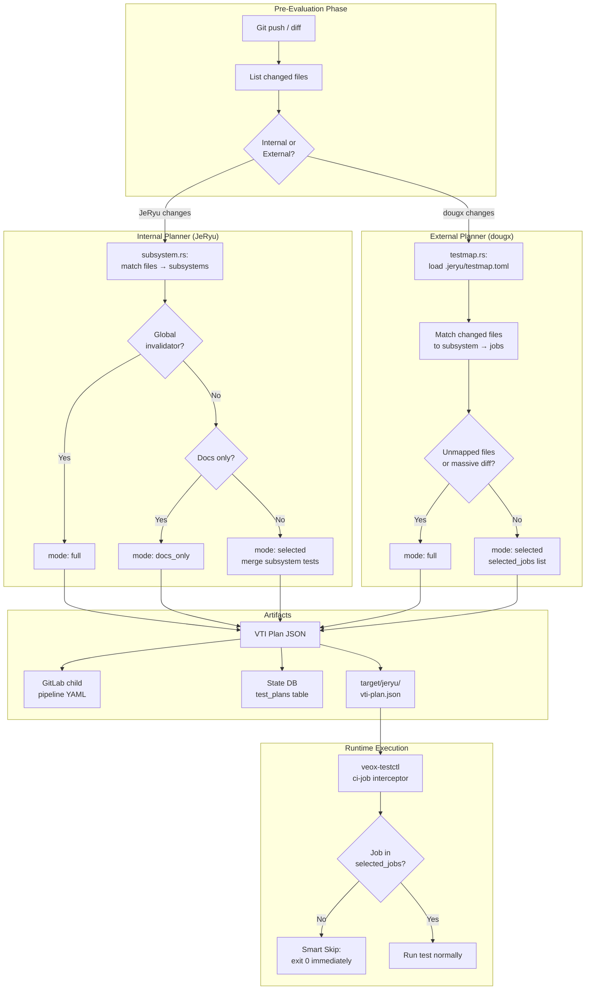
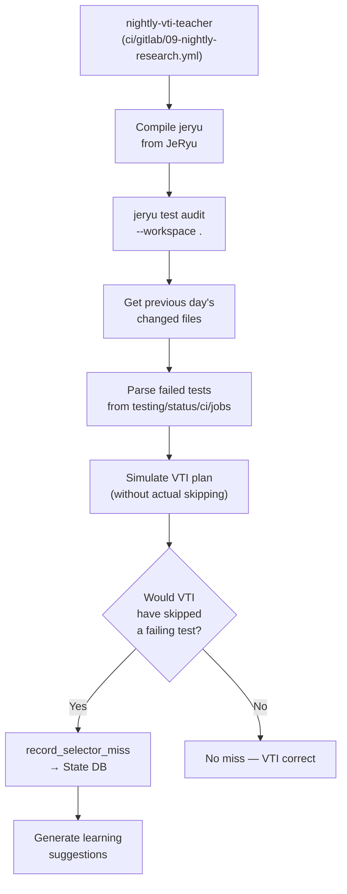

# VTI.md — Jeryu Test Intelligence: Complete Smart Test Selection Reference

> Version: 3.0.1
> Last updated: 2026-04-27
> Source modules: `src/test_intel/` (planner, testmap, subsystem, ci_gen, explain, cache, nightly)
> Audience: External agents, reviewers, and contributors requiring full VTI context.

VTI (Jeryu Test Intelligence) is a subsystem-aware smart test selection system that maps changed source files to the minimal set of tests required to validate the change. In V3.01, internal plans can emit proof receipts and the default merge gate blocks when required receipt evidence is missing or bound to a different head SHA. VTI reduces CI latency only when it can explain the validation it selected or skipped.

---

## 1. Architectural Overview



The architecture operates in two fundamentally different modes:

1. **Internal Planner** (`planner.rs`): For changes within the JeRyu codebase itself — uses hardcoded subsystem definitions in `subsystem.rs`.
2. **External Planner** (`testmap.rs`): For changes in external workspaces (currently `dougx`) — uses `.jeryu/testmap.toml` declarative configuration.

---

## 2. Internal Planner (JeRyu Changes)

### 2.1 Subsystem Ownership Graph

`src/test_intel/subsystem.rs` defines the complete ownership mapping from source files to named subsystems. Each subsystem specifies:

| Field | Purpose |
| --- | --- |
| `id` | Unique subsystem identifier (e.g., `pool`, `cache`, `agent`) |
| `description` | Human-readable description |
| `owned_paths` | Glob patterns for owned source files |
| `unit_filter` | Nextest filter expression for unit tests |
| `integration_tests` | Integration test binary names from `tests/` |
| `force_full_paths` | Paths that force full test run if changed |
| `runner_tags` | Required GitLab runner tags |
| `cross_cutting` | Whether changes affect many subsystems |

### 2.2 Registered Subsystems

| Subsystem | Owned paths | Unit filter | Integration tests | Cross-cutting |
| --- | --- | --- | --- | --- |
| `pool` | `src/pool.rs`, `src/docker.rs` | `test(/pool\|docker\|runner/)` | pool_tests, job_tests | no |
| `cache` | `src/cache.rs`, `src/cache_brain.rs`, `src/cache_proxy.rs`, `src/gateway/*`, `src/epoch.rs`, `src/taint.rs`, `src/witness.rs`, `src/sccache_mgr.rs` | `test(/cache\|singleflight\|gateway\|taint\|epoch\|witness\|sccache/)` | cache_integration_test | no |
| `agent` | `src/agent.rs`, `src/capability.rs` | `test(/agent\|capability\|risk_gate/)` | agent_tests | no |
| `engine` | `src/engine.rs` | `test(/webhook\|pipeline\|supersedence\|reconcil/)` | job_tests | no |
| `release` | `src/release.rs`, `src/secrets.rs` | `test(/release\|canary\|secret\|vault\|promote/)` | — | no |
| `decision` | `src/decision.rs`, `src/capsule.rs` | `test(/decision\|risk_gate\|retry\|classif\|capsule/)` | — | no |
| `tui` | `src/tui/*` | `test(/tui\|snapshot\|render\|widget/)` | — | no |
| `state` | `src/state.rs` | `test(/state\|redline\|db\|migrat/)` | pool_tests, job_tests, agent_tests, cache_integration_test | **yes** |
| `config` | `src/config.rs`, `src/bootstrap.rs` | `test(/config\|template\|bootstrap/)` | pool_tests | no |
| `impact` | `src/impact.rs`, `src/test_runner.rs`, `src/test_intel/*` | `test(/impact\|test_run\|test_intel\|plan_from/)` | — | no |
| `exec` | `src/exec.rs`, `src/sandbox.rs`, `src/honeypot.rs` | `test(/exec\|sandbox\|honeypot\|custom_exec/)` | e2e | no |
| `gitlab_client` | `src/gitlab_client.rs` | `test(/gitlab\|client\|api\|endpoint/)` | — | no |
| `observability` | `src/telemetry.rs`, `src/logs.rs` | `test(/telemetry\|log/)` | — | no |
| `explain_mod` | `src/explain.rs`, `src/buildkit.rs` | `test(/explain\|buildkit/)` | — | no |
| `reclaim` | `src/reclaim.rs` | `test(/reclaim\|gc\|garbage/)` | — | no |

### 2.3 Global Invalidators

These paths ALWAYS trigger a full test run:

```
Cargo.toml, Cargo.lock, rust-toolchain.toml, rust-toolchain,
.cargo/*, .gitlab-ci.yml, .github/workflows/*, build.rs,
src/admission.rs, src/policy.rs
```

### 2.4 Docs-Only Patterns

If ALL changed files match these patterns, VTI marks the change as `docs_only` (skip all tests):

```
*.md, docs/*, LICENSE, .gitignore, .editorconfig
```

### 2.5 Planning Algorithm

`planner::plan_tests(changed_paths)` executes:

1. **Check global invalidators**: if any changed path matches → `mode: full`, all tests selected.
2. **Check docs-only**: if all paths are docs → `mode: docs_only`, no tests needed.
3. **Match subsystems**: find all subsystems that own at least one changed file.
4. **Check force-full triggers**: if any affected subsystem has `force_full_paths` matching the changes → `mode: full`.
5. **Build selected tests**: merge unit_filter and integration_tests from all affected subsystems → `mode: selected`.
6. **Compute confidence**: based on coverage of changed files by known subsystems.

Output: `TestPlan { mode, selected_tests, skipped_subsystems, confidence, fallback_reason }`.

V3.01 adds `TestPlan::receipt(base_sha, head_sha)`, which produces a `VtiReceipt` with a stable receipt id, policy version, mode, confidence, selected tests, skipped subsystems, changed paths, fallback reason, and optional base/head identity. `jeryu test select --emit-receipt <path>` writes this receipt as JSON. Merge proof can require the receipt and reject stale or missing receipt evidence.

### 2.6 Subsystem Force-Full Triggers

The `impact` subsystem defines `force_full_paths: ["src/test_intel/*"]`. This means changes to VTI itself always trigger a full test run — a safety measure until nightly audit confirms correctness.

---

## 3. Glob Matching Engine

`subsystem.rs` implements a lightweight glob matcher (no external crate). Supported patterns:

| Pattern | Meaning | Example match |
| --- | --- | --- |
| `foo/bar` | Exact match | `foo/bar` |
| `foo/*` | Single-level directory children | `foo/handler.rs` (not `foo/sub/deep.rs`) |
| `foo/**` | Recursive directory match | `foo/sub/deep/file.rs` |
| `dir/**/*.ext` | Recursive extension match under dir | `dir/sub/file.ext` |
| `*.ext` | Files ending with `.ext` at any depth | `deep/path/readme.md` |
| `Foo*` | Files starting with `Foo` | `Dockerfile.prod` |
| `**/foo` | `foo` as last path component anywhere | `a/b/c/foo` |

For basename-level patterns (no `/` in pattern), matching occurs against the file's basename.

---

## 4. External Planner (dougx / testmap.toml)

### 4.1 testmap.toml Schema

Located at `<workspace>/.jeryu/testmap.toml`. Declares subsystem boundaries for an external workspace:

```toml
[metadata]
name = "dougx"
version = "1.0"

[global]
# Paths that always trigger full test run
invalidators = [
    "Cargo.toml",
    "Cargo.lock",
    ".gitlab-ci.yml",
]

# File patterns that indicate docs-only changes
docs_patterns = [
    "*.md",
    "docs/*",
]

[[subsystem]]
name = "core"
paths = ["apps/veox-core/**"]
jobs = ["test-rust-nextest-1", "test-rust-nextest-2"]

[[subsystem]]
name = "deploy"
paths = ["ops/**", "ci/**"]
jobs = ["test-shell-e2e"]

[[subsystem]]
name = "frontend"
paths = ["apps/veox-web/**"]
jobs = ["test-frontend"]
```

### 4.2 External Planning Algorithm

`testmap::plan_from_testmap(map, changed_paths)`:

1. **Check global invalidators** from testmap → `mode: full` if any match.
2. **Check docs-only** from testmap → `mode: docs_only` if all match.
3. **Map changed files to subsystems** → collect unique `jobs` from matched subsystems.
4. **Check for unmapped files** — if any changed file doesn't match any subsystem, trigger `mode: full` as a safety fallback.
5. Otherwise → `mode: selected` with the deduplicated job list.

Output: `ExternalTestPlan { mode, selected_jobs, skipped_jobs, confidence, fallback_reason }`.

### 4.3 Artifact Emission

The external planner can emit three artifacts:

| Artifact | Flag | Purpose |
| --- | --- | --- |
| GitLab child pipeline YAML | `--emit-gitlab <path>` | Dynamically generated CI config |
| VTI plan JSON | `--emit-plan <path>` | Machine-readable plan for runtime interception |
| Skipped jobs metadata | `--emit-skipped <path>` | JSON metadata for skipped CI jobs |

---

## 5. VTI Plan JSON Schema

### 5.1 Internal Plan

```json
{
  "mode": "selected",
  "confidence": 0.95,
  "selected_tests": [
    {
      "subsystem": "pool",
      "command": "cargo nextest run -p jeryu -E 'test(/pool|docker|runner/)'",
      "integration_tests": ["pool_tests", "job_tests"],
      "tags": ["build", "docker-build"]
    }
  ],
  "skipped_subsystems": ["tui", "cache", "release"],
  "fallback_reason": null
}
```

### 5.2 External Plan

```json
{
  "mode": "selected",
  "confidence": 0.92,
  "selected_jobs": ["lint-cargo-fmt", "test-rust-nextest-1"],
  "skipped_jobs": ["test-shell-e2e", "test-frontend"],
  "fallback_reason": null
}
```

### 5.3 Mode Values

| Mode | Meaning |
| --- | --- |
| `full` | All tests must run — global invalidator, unmapped file, or massive diff |
| `selected` | Only the listed tests/jobs are required |
| `docs_only` | No tests needed — only documentation files changed |

---

## 6. GitLab CI Integration

### 6.1 Child Pipeline YAML Generation

`ci_gen.rs` generates GitLab child pipeline YAML from a VTI plan. Each selected test becomes a CI job with appropriate tags, image, stage, and test command.

### 6.2 Runtime Job Interception (veox-testctl)

In the `dougx` workspace, the VTI plan flows through a runtime interception architecture:

1. **`plan-tests` job** (in `.gitlab-ci.yml` lint stage): Compiles `jeryu`, runs `jeryu test select-external --workspace .`, emits `target/jeryu/vti-plan.json` as artifact.

2. **Downstream test jobs**: Each test job's runner invokes `cargo run -p veox-testctl -- ci-job <job_name>`.

3. **veox-testctl `run_ci_job`** (in `dougx/apps/veox-testctl/src/ci.rs`):
   - Reads `target/jeryu/vti-plan.json` before test execution begins
   - If `mode == "selected"` and the current job is NOT in `selected_jobs`:
     - Logs `"VTI Smart Skip: intelligently bypassing job..."`
     - Writes a pseudo-green `JobRecord` to `testing/status/ci/jobs_latest.json` (telemetry parity)
     - Exits `0` immediately
   - If `mode == "full"` or job IS in `selected_jobs`:
     - Proceeds with normal test execution

4. **Artifact handoff**: Test jobs must include `plan-tests` in their `needs:` array to receive the `target/jeryu/vti-plan.json` artifact. Jobs without this dependency execute fully (graceful fallback).

### 6.3 Relevant dougx CI Files

| File | Role |
| --- | --- |
| `ci/gitlab/06-vti-selection.yml` | `plan-tests` job: compiles jeryu, scans diff, emits plan artifact |
| `apps/veox-testctl/src/ci.rs` | Runtime skip interceptor |
| `ci/gitlab/00-templates.yml` | Optional artifact inheritance schemas for `target/jeryu/vti-plan.json` |
| `ci/gitlab/02-test-rust.yml` | Test implementations using VTI artifact |
| `ci/gitlab/04-test-shell-e2e.yml` | E2E tests using VTI artifact |
| `ci/gitlab/09-nightly-research.yml` | Nightly oracle `nightly-vti-teacher` job |

---

## 7. Cache Key Computation

`test_intel/cache.rs` computes deterministic cache keys for test commands:

```
cache_key = SHA256(
    test_command
    + sorted(changed_file_hashes)
    + Cargo.lock_hash
    + rustc_version
    + epoch
)
```

Components:
- **test_command**: the exact cargo test command string
- **changed_file_hashes**: `git hash-object` for each changed file, sorted
- **Cargo.lock_hash**: `git hash-object Cargo.lock`
- **rustc_version**: output of `rustc --version`
- **epoch**: cache invalidation epoch from `EpochManager`

This cache key is used by `jeryu test cache-status` to show which tests can be safely skipped based on input identity.

---

## 8. Nightly Oracle (Self-Auditing System)

### 8.1 Purpose

The nightly oracle (`test_intel/nightly.rs`) is a self-healing mechanism that detects **selector misses** — situations where VTI would have skipped a test that actually failed. Over time, this surfaces gaps in subsystem definitions and testmap.toml rules.

### 8.2 Flow



### 8.3 Selector Miss

A selector miss means: **a test naturally failed, but VTI would have forcefully skipped it had it been authorized to do so**. This is the highest-severity VTI bug class.

Misses are persisted through the configured state backend via `state::record_selector_miss(plan_id, missed_test, failed_sha, detected_by)` and are queryable via `count_selector_misses_since(since)`.

### 8.4 Learning

`nightly::learn_from_audit(report)` produces:
- **`processed`**: total tests examined
- **`new_misses`**: count of new selector misses
- **`flagged_subsystems`**: subsystems with coverage gaps
- **`suggestions`**: specific rule improvement recommendations (e.g., "add path `src/foo.rs` to subsystem `bar`")

### 8.5 CLI Commands

```bash
# Run selector audit against actual test results
jeryu test audit --changed src/pool.rs,src/docker.rs --all-tests pool_tests,cache_test --failed pool_tests --sha HEAD

# Learn from audit and get suggestions
jeryu test learn --changed src/pool.rs --all-tests pool_tests --failed pool_tests --sha HEAD --json

# Check selector miss count (used by jeryu next)
# Internal: db.count_selector_misses_since(since)
```

### 8.6 Workspace Context

When running audit externally (against `dougx`), use `--workspace .` to ensure `testmap.rs` rules are used instead of `planner.rs` rules. Running without `--workspace` inside `dougx` would use JeRyu's internal planner, polluting the configured state database with incoherent selector misses.

---

## 9. Explanation Engine

`test_intel/explain.rs` renders plans in both human-readable text and machine-readable JSON:

- `explain(plan)` → text rendering showing mode, confidence, selected tests, skipped subsystems, warnings
- `explain_json(plan)` → structured JSON for agent consumption
- `test_intel::testmap::explain_external_plan(plan)` → text for external plans
- `test_intel::testmap::explain_external_json(plan)` → JSON for external plans
- `test_intel::testmap::explain_external_skipped_json(plan)` → JSON metadata for skipped jobs

---

## 10. VTI Data Flow Summary

### 10.1 Push Hook → VTI Plan

When a push hook arrives at the engine:

```
Push Hook → normalize ref → skip jeryu-test-* → impact analysis
→ if changed_paths exist → planner::plan_tests(changed_paths)
→ db.record_test_plan(plan) + db.record_test_plan_item(items)
→ event ledger: impact_decision
```

### 10.2 CLI-Triggered Selection

```
jeryu test select --base origin/main --head HEAD
→ git diff --name-only base head
→ planner::plan_tests(changed_paths)
→ optional: emit GitLab YAML, emit JSON plan
```

### 10.3 External CI Pipeline Selection

```
jeryu test select-external --workspace /home/ubuntu/dougx
→ load .jeryu/testmap.toml
→ git diff --name-only base head (in workspace)
→ testmap::plan_from_testmap(map, changed_paths)
→ emit target/jeryu/vti-plan.json
→ veox-testctl ci-job <name> reads plan → skip or execute
```

---

## 11. Failure Points and Fallbacks

| Failure Point | Behavior |
| --- | --- |
| `plan-tests` job fails to compile jeryu | Catches error, emits `{"mode": "full"}` — all tests run normally |
| Changed file not mapped to any subsystem (external) | Triggers `mode: full` — safety fallback |
| GitLab `needs:` array missing `plan-tests` | Job never downloads `vti-plan.json`, executes fully |
| `vti-plan.json` absent or unparseable | `veox-testctl` skips evaluation, job executes fully |
| `jeryu test audit` run without `--workspace` in dougx | Uses internal planner rules, pollutes DB with bad misses |
| Global invalidator changed (Cargo.toml, etc.) | Forces `mode: full` — all tests mandatory |
| `force_full_paths` trigger in subsystem | Forces `mode: full` for entire plan |

All failure modes default to **full execution** — VTI never silently drops tests on error.

---

## 12. Key Source Files

### JeRyu Codebase

| File | Purpose |
| --- | --- |
| `src/test_intel/mod.rs` | Module root, exports |
| `src/test_intel/planner.rs` | Internal planner: `plan_tests()`, `TestPlan` type |
| `src/test_intel/testmap.rs` | External planner: `load_testmap()`, `plan_from_testmap()`, `ExternalTestPlan` |
| `src/test_intel/subsystem.rs` | Subsystem ownership graph, `glob_match()`, `SUBSYSTEMS`, `GLOBAL_INVALIDATORS`, `DOCS_PATTERNS` |
| `src/test_intel/ci_gen.rs` | `emit_gitlab_child_yaml()` |
| `src/test_intel/explain.rs` | `explain()`, `explain_json()` |
| `src/test_intel/cache.rs` | `compute_cache_key()`, `check_cache()`, `TestCacheKey` |
| `src/test_intel/nightly.rs` | `audit_selector()`, `learn_from_audit()`, `explain_audit()` |
| `src/state.rs` | `record_test_plan()`, `record_test_plan_item()`, `record_selector_miss()`, `count_selector_misses_since()`, `latest_test_plan()` |
| `src/dispatch.rs` | CLI wiring for all `test` subcommands |
| `src/engine.rs` | Push hook → VTI plan recording |

### dougx Codebase

| File | Purpose |
| --- | --- |
| `.jeryu/testmap.toml` | Subsystem boundary declarations for VTI |
| `apps/veox-testctl/src/ci.rs` | Runtime job interceptor (`run_ci_job`) |
| `ci/gitlab/06-vti-selection.yml` | `plan-tests` CI job manifest |
| `ci/gitlab/00-templates.yml` | Artifact inheritance for VTI plan |
| `ci/gitlab/09-nightly-research.yml` | Nightly oracle job |
| `ci/gitlab/02-test-rust.yml` | Rust test jobs using VTI |
| `ci/gitlab/04-test-shell-e2e.yml` | E2E tests using VTI |

---

## 13. Cross-Repo Contract

VTI spans two repositories:

| Surface | Owner | Consumer | Invariant |
| --- | --- | --- | --- |
| `.jeryu/testmap.toml` | dougx | JeRyu | JeRyu reads, never writes |
| `ci.rs` runtime interceptor | dougx | — | Reads VTI plan, decides skip/execute |
| VTI planner/testmap modules | JeRyu | dougx CI | Produces plan consumed at runtime |
| Selector miss database | JeRyu | Nightly oracle | Append-only; queried for learning |

If testmap.toml schema changes in dougx, validate locally:
```bash
cargo check -p jeryu --message-format=json
cargo test -p jeryu -- test_intel -- --nocapture
```

---

## 14. Proof Lane and Change Type

VTI module changes (`src/test_intel/*`) are classified as `api-change` in `proof-lanes.toml`, requiring: check, unit, integration proof lanes.

The `impact` subsystem defines `force_full_paths: ["src/test_intel/*"]`, meaning changes to VTI itself always force full test execution — preventing VTI from silently accepting its own bugs.
