# JeRyu Autonomous Delivery Flow Map

This document is a diagram specification for JeRyu's autonomous delivery path.
It is intentionally detailed so a later visual diagram can be generated from
the same node names, edge labels, artifacts, and control-plane boundaries.

The flow covers:

- MR CI on local GitLab.
- SHA-fenced merge into protected `main`.
- Post-merge mirroring to GitHub and GitLab mainline follow-up.
- GitLab and GitHub main CI.
- Build, evidence, SBOM, screenshot, web, and release artifacts.
- Local dogfood, development, release, and production/canary paths.
- The safe places where agents can plug in.

## Status Markers

Use these markers in diagrams and implementation reviews:

| Marker | Meaning |
|---|---|
| `[CURRENT]` | Present in the root worktree or existing shipped docs/config. |
| `[IN-FLIGHT]` | Present in current coordination work/MRs but not necessarily merged into this root checkout. |
| `[PARTIAL]` | Implemented enough to render or rehearse, but not complete enforcement. |
| `[MANUAL]` | Requires an operator trigger, protected environment, or local command today. |
| `[PLANNED]` | Architecture target described by docs or policies, but not fully wired. |
| `[ANTI-PATTERN]` | Existing behavior that should be removed or guarded before being treated as safe autonomy. |

## Source Files Studied

Core policy and narrative:

- [docs/autonomous-delivery.md](autonomous-delivery.md)
- [docs/autonomous-deployment.md](autonomous-deployment.md)
- [docs/release-policy.md](release-policy.md)
- [docs/evidence-gate-spec.md](evidence-gate-spec.md)
- [docs/ci-local.md](ci-local.md)
- [release.policy.toml](../release.policy.toml)
- [.jeryu/policy.toml](../.jeryu/policy.toml)
- [.jeryu/ci.toml](../.jeryu/ci.toml)

CI and script entrypoints:

- [.gitlab-ci.yml](../.gitlab-ci.yml)
- [.github/workflows/rust.yml](../.github/workflows/rust.yml)
- [.github/workflows/jankurai.yml](../.github/workflows/jankurai.yml)
- [.github/workflows/release-ready.yml](../.github/workflows/release-ready.yml)
- [.github/workflows/post-merge-deploy.yml](../.github/workflows/post-merge-deploy.yml)
- [.github/workflows/release.yml](../.github/workflows/release.yml)
- [.github/workflows/web.yml](../.github/workflows/web.yml)
- [.github/workflows/auto-merge.yml](../.github/workflows/auto-merge.yml)
- [ops/ci/rust-lane.sh](../ops/ci/rust-lane.sh)
- [ops/ci/jankurai-lane.sh](../ops/ci/jankurai-lane.sh)
- [ops/ci/release-ready-lane.sh](../ops/ci/release-ready-lane.sh)
- [ops/ci/post-merge-deploy-lane.sh](../ops/ci/post-merge-deploy-lane.sh)
- [ops/ci/release-lane.sh](../ops/ci/release-lane.sh)
- [scripts/deploy-local.sh](../scripts/deploy-local.sh)

Merge, mirror, release, and agent surfaces:

- [src/git_host/gitlab_merge.rs](../src/git_host/gitlab_merge.rs)
- [src/merge/merge_gate.rs](../src/merge/merge_gate.rs)
- [src/merge/service.rs](../src/merge/service.rs)
- [src/git/mirror.rs](../src/git/mirror.rs)
- [src/git/mirror_jobs.rs](../src/git/mirror_jobs.rs)
- [src/git/executor.rs](../src/git/executor.rs)
- [src/release/full_path.rs](../src/release/full_path.rs)
- [src/release/gate.rs](../src/release/gate.rs)
- [src/release/gate_logic.rs](../src/release/gate_logic.rs)
- [src/release/capsule.rs](../src/release/capsule.rs)
- [src/commands/agent_submit.rs](../src/commands/agent_submit.rs)
- [src/agent_runtime_merge.rs](../src/agent_runtime_merge.rs)
- [src/capability_actions.rs](../src/capability_actions.rs)
- [src/capability_execute.rs](../src/capability_execute.rs)
- [src/mcp/tools.rs](../src/mcp/tools.rs)
- [src/autonomy/mcp_tools.rs](../src/autonomy/mcp_tools.rs)
- [src/tui/action_registry_entries.rs](../src/tui/action_registry_entries.rs)
- [src/tui/workflow/delivery/mod.rs](../src/tui/workflow/delivery/mod.rs)
- [src/tui/workflow/live_delivery.rs](../src/tui/workflow/live_delivery.rs)

## System Boundary

JeRyu has two git-host planes:

1. Local GitLab is the canonical local control plane for MRs, local CI, merge
   gating, runner health, and local agent workspaces.
2. GitHub is the public/external release and mirror plane. GitHub Actions repeat
   required checks after `main` arrives there, provide GitHub check-runs, publish
   releases, and host the public release artifact.

Agents must use JeRyu surfaces, not direct GitLab API loops:

- Allowed: `jeryu` CLI, JeRyu MCP/capability tools, JeRyu web/API surfaces,
  local SSH remotes configured by `jeryu access repair`.
- Not allowed: `glab`, credential scraping, raw local GitLab `/api/v4` calls,
  token-bearing shell loops, HTTP local GitLab origins.

## One-Screen Flow

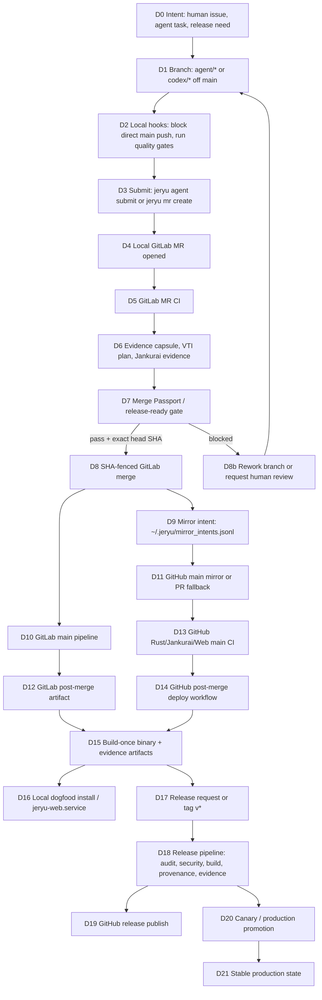

## Primary Swimlanes

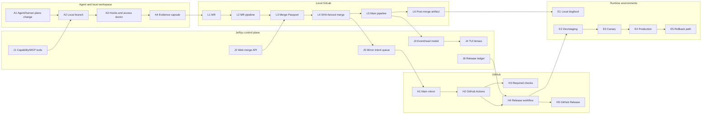

## Detailed Node Catalog

The IDs below are stable labels for a future visual diagram.

| ID | Plane | Status | Trigger | Source of truth | Output/state | Agent plug-in |
|---|---|---:|---|---|---|---|
| D0 | Intent | `[CURRENT]` | Human issue, task, bug, release request | `jeryu agent submit`, bug tracker, release docs | Task text, issue link, risk tier | Planner agent, triage agent |
| D1 | Local workspace | `[CURRENT]` | Branch from `main` | Git branch, access contract | `agent/*`, `codex/*`, feature branch | Authoring agent |
| D2 | Local hooks | `[CURRENT]` | `git push` | [.jeryu/hooks/pre-push](../.jeryu/hooks/pre-push), [ops/git-hooks/pre-push](../ops/git-hooks/pre-push) | Direct `main` push blocked, quality gates run | Hook install/audit agent |
| D3 | Submit | `[CURRENT]` | `jeryu agent submit` or MR command | [src/commands/agent_submit.rs](../src/commands/agent_submit.rs) | Capsule plus draft MR/PR | Submit agent |
| D4 | Local GitLab MR | `[CURRENT]` | Branch push or native GitLab client | `create_merge_request` through JeRyu client | MR IID, MR URL | Reviewer agents, CI healer |
| D5 | GitLab MR CI | `[CURRENT]` | `merge_request_event` | [.gitlab-ci.yml](../.gitlab-ci.yml) | Rust/Jankurai/evidence jobs | CI diagnosis agent |
| D6 | Evidence pack | `[CURRENT]` | MR CI and agent submit | [src/release/capsule.rs](../src/release/capsule.rs), `ops/ci/*` | Capsule, VTI plan, receipts | Evidence agent |
| D7 | Merge Passport | `[PARTIAL]` | MR detail/merge request | [src/merge/merge_gate.rs](../src/merge/merge_gate.rs) | Pass/blocked plus blockers | Judge agent |
| D8 | Merge | `[CURRENT]` | Approve/merge action | [src/merge/service.rs](../src/merge/service.rs), [src/git_host/gitlab_merge.rs](../src/git_host/gitlab_merge.rs) | GitLab merge result SHA | Merge steward agent |
| D9 | Mirror intent | `[IN-FLIGHT]` | Successful GitLab merge | [src/git/mirror_jobs.rs](../src/git/mirror_jobs.rs) | Append-only JSONL row | Mirror repair agent |
| D10 | GitLab main CI | `[CURRENT]` | Push to `main` | [.gitlab-ci.yml](../.gitlab-ci.yml) | Main pipeline, health/evidence | Pipeline watchdog |
| D11 | GitHub main handoff | `[PARTIAL]` | Mirror hook or full-path handoff | [src/git/mirror.rs](../src/git/mirror.rs), [src/release/full_path.rs](../src/release/full_path.rs) | GitHub `main` push or draft PR fallback | Mirror relay agent |
| D12 | GitLab artifact build | `[CURRENT]` | Main pipeline | `.gitlab-ci.yml:post_merge_build_artifact` | `target/release/jeryu` artifact | Artifact verifier |
| D13 | GitHub main CI | `[CURRENT]` | GitHub push to `main` | `.github/workflows/*.yml` | Required checks and artifacts | GitHub CI watcher |
| D14 | GitHub post-merge deploy | `[CURRENT]` | Completed green Rust workflow | [.github/workflows/post-merge-deploy.yml](../.github/workflows/post-merge-deploy.yml) | Release binary artifact and optional install | Deploy steward |
| D15 | Artifact lineage | `[CURRENT]` | Build stages | `target/release/jeryu`, `target/jankurai/*`, `ops/releases/*` | Binary, SBOM, evidence, screenshots | Provenance agent |
| D16 | Local dogfood | `[CURRENT]` | Deploy lane or local install | [scripts/deploy-local.sh](../scripts/deploy-local.sh) | Installed `jeryu`, TUI smoke, web restart | Local release shepherd |
| D17 | Release request/tag | `[CURRENT]` | `jeryu release submit`, tag push, workflow dispatch | [src/commands/release_ops.rs](../src/commands/release_ops.rs), [.github/workflows/release.yml](../.github/workflows/release.yml) | `v*` tag, release run | Release shepherd |
| D18 | Release CI | `[CURRENT]` | Tag or manual dispatch | [ops/ci/release-lane.sh](../ops/ci/release-lane.sh) | Audit, security, build, provenance, evidence | Security/release agents |
| D19 | Publish | `[CURRENT]` | Green release pipeline | `release-lane.sh publish` | GitHub Release with binary | Publish agent |
| D20 | Canary/prod promotion | `[PARTIAL]` | Green main/release pipeline webhook or command | [src/engine_webhook_pipeline.rs](../src/engine_webhook_pipeline.rs), [src/release/full_path.rs](../src/release/full_path.rs) | Release attempt, production pipeline, canary status | Nightwatch agent |
| D21 | Stable production | `[PLANNED]` | Canary complete and release doctor pass | release policy, release lifecycle modules | Stable channel, rollback metadata | Production steward |

## MR CI Detail

GitLab is the primary local MR CI executor. Its stages are:

1. `quality`
2. `build`
3. `test`
4. `evidence`
5. `release`
6. `deploy`

### MR Pipeline Diagram

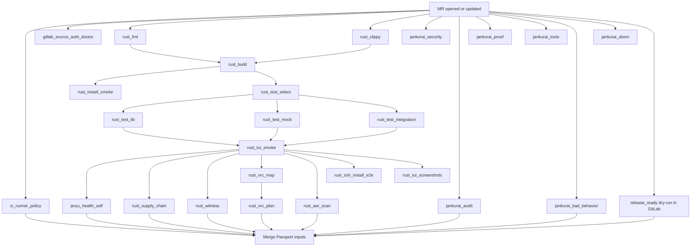

### GitLab MR CI Job Groups

| Group | Jobs | Current role | Artifacts |
|---|---|---|---|
| Runner/policy | `ci_runner_policy`, `gitlab_source_auth_doctor` | Enforce no runner tags and check CI source auth. `gitlab_source_auth_doctor` is currently fail-open. | Logs only |
| Rust quality | `rust_fmt`, `rust_clippy` | Format and lint. | Logs |
| Rust build | `rust_build`, `rust_install_smoke` | Compile workspace and exercise install commands. | Build logs |
| Test selection | `rust_test_select` | VTI mode and filter selection. | `target/jeryu/test-plan.json` |
| Tests | `rust_test_lib`, `rust_test_mock`, `rust_test_integration`, `rust_fixture_project_tests` | Unit, offline GitLab mocks, integration, fixture project. | Test logs |
| TUI evidence | `rust_tui_smoke`, `rust_tui_screenshots` | One-frame render, deterministic PNG/GIF artifacts. | `target/ci-screenshots/`, README media |
| Health | `jeryu_health_self` | `jeryu health --ci --json` must report `ok=true`. | `target/jeryu/health.json` |
| Supply/proof | `rust_supply_chain`, `rust_witness`, `rust_vrc_map`, `rust_vrc_plan`, `rust_aer_scan`, `rust_ssh_install_e2e` | Supply-chain, witness graph, agent/test maps, AER, SSH install proof. | `.witness/witness-graph.json`, `agent-map.json`, `test-map.json`, `vrc-plan.json`, `aer-findings.json`, `target/ci-evidence/ssh-install/` |
| Jankurai | `jankurai_security`, `jankurai_audit`, `jankurai_proof`, `jankurai_tools`, `jankurai_bad_behavior`, `jankurai_sbom` | Security, audit, proof lanes, bad behavior, SBOM. Some lanes are currently fail-open in GitLab. | `target/jankurai/*` |
| Release ready | `release_ready` | GitLab rehearsal of release-ready. Uses `JERYU_EMIT_STATUS=0`, so it does not post GitHub status from GitLab. | Logs and local receipt behavior |

## GitHub Actions Detail

GitHub Actions duplicate or complement the local GitLab gates after code reaches
GitHub. They are not the agent-facing local API, but they are part of the
public/external quality and release plane.

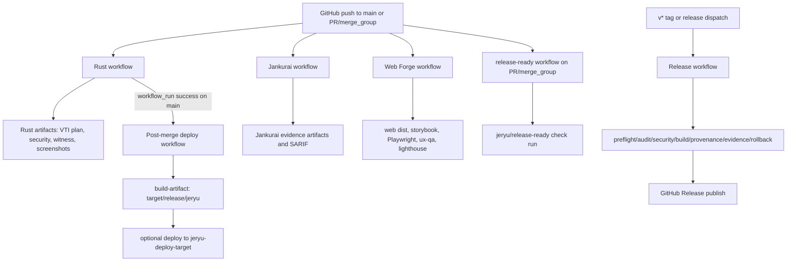

GitHub workflows:

| Workflow | Triggers | Role | Important outputs |
|---|---|---|---|
| `rust.yml` | push `main`, PR to `main`, merge_group, weekly schedule | Core Rust quality, tests, security, TUI proof. | VTI plan, security evidence, witness graph, VRC maps, AER findings, SSH evidence, TUI screenshots. |
| `jankurai.yml` | PR, merge_group, push `main` | Jankurai security/audit/proof/tools/bad-behavior/SBOM lanes. | `target/jankurai/*`, SARIF, SBOM attestations. |
| `release-ready.yml` | PR to `main`, merge_group | Posts the `jeryu/release-ready` check using `JERYU_EMIT_STATUS=1`. | GitHub check-run, `.jeryu/release-ready/receipts/*.json` during job. |
| `post-merge-deploy.yml` | completed green Rust workflow on `main`, manual force | Rebuilds artifact at triggering SHA, verifies TUI, uploads binary, optionally deploys. | `jeryu-<version>-<sha>` artifact. |
| `release.yml` | tag `v*`, workflow_dispatch | Release audit/security/build/provenance/evidence/rollback/publish. | Binary artifact, SBOM/provenance attestations, release evidence, GitHub Release. |
| `web.yml` | push `main`, push `web-forge/**`, PR, merge_group | Web feature proof. | SPA dist, Storybook, Playwright report, UX-QA, Lighthouse. |
| `auto-merge.yml` | PR lifecycle, Rust/Jankurai workflow completion | Enables GitHub auto-merge when classified safe. | GitHub auto-merge request. |

Known GitHub caveat to diagram as a red edge:

- `rust.yml` currently refreshes README TUI media and can `git push` directly
  on `main` when not a PR. That is useful automation but conflicts with the
  "no direct main mutation" rule. The safe target design is: generate media as
  an artifact or open an MR/PR through JeRyu, not direct-push from CI.

## Merge Gate and SHA Fence

Merge is not "CI green, then push main." It has a gate and an exact SHA fence.

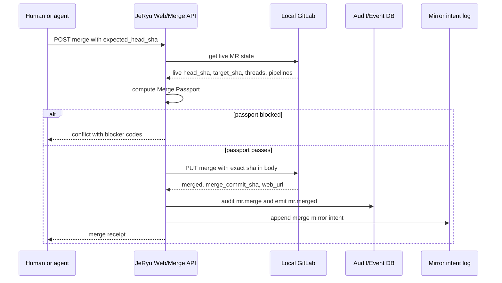

Current concrete gates in [src/merge/merge_gate.rs](../src/merge/merge_gate.rs):

| Gate | Current behavior |
|---|---|
| Source SHA unchanged | Checks previewed source SHA when supplied. |
| Target branch SHA checked | Checks previewed target SHA when supplied. |
| Target policy SHA checked | Checks previewed target policy SHA when available. |
| Required approvals | Stubbed as OK until local approvals table is wired. |
| CODEOWNERS | Stubbed as OK. |
| Threads resolved | Lists review threads and blocks unresolved discussions. |
| Required CI green | Reads pipelines for the MR head SHA; treats success/skipped/manual as green. |
| VTI/test plan acceptable | Stubbed as OK. |
| Agent evidence fresh/signed | Stubbed as OK. |
| Branch protection | Stubbed as OK. |
| Conflict/rebase status | Stubbed because adapter does not yet project `merge_status`. |
| Release window/freeze | Stubbed as OK. |

The merge write itself goes through
[src/git_host/gitlab_merge.rs](../src/git_host/gitlab_merge.rs), which sends
the expected SHA in the GitLab merge request body and maps `409` conflicts to a
host conflict. This is the most important safety fence in the flow.

## Mirror and Dual-Host Flow

There are three mirror/handoff mechanisms to keep separate in diagrams:

1. `jeryu git` passthrough mirror: local git wrapper can mirror successful
   `git push` operations to a configured remote through
   [src/git/executor.rs](../src/git/executor.rs) and
   [src/git/mirror.rs](../src/git/mirror.rs).
2. Post-merge mirror intent: successful local GitLab MR merge appends a row to
   `~/.jeryu/mirror_intents.jsonl` through
   [src/git/mirror_jobs.rs](../src/git/mirror_jobs.rs). A background consumer is
   in flight to push GitHub `main` or open a PR fallback.
3. Release full-path GitHub handoff: [src/release/full_path.rs](../src/release/full_path.rs)
   calls `shadow_main_runs`; if the shadow push fails or is not configured, it
   writes a GitHub PR body and opens a draft PR fallback.

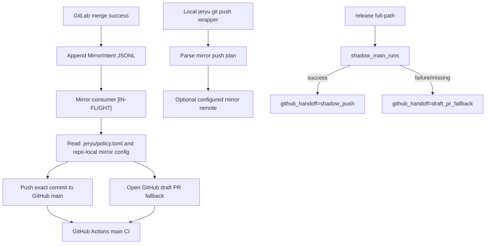

Mirror safety requirements for the target architecture:

- Mirror only after local GitLab merge succeeds.
- Bind the mirror action to the exact merged SHA.
- Record source host, project path, MR IID, target ref, and final SHA.
- Treat a protected GitHub `main` rejection as a draft PR fallback, not as a
  reason to bypass branch protection.
- Never expose raw tokens or direct GitLab API examples to agents.
- Do not consume a mirror intent on transient failure; retry or leave it
  pending with visible status.

## Artifact Lineage

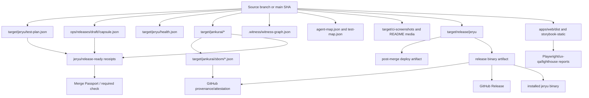

Artifact table:

| Artifact | Produced by | Path/name | Consumer |
|---|---|---|---|
| Evidence capsule | `jeryu agent submit` | `ops/releases/draft/<branch>/capsule.json` | Reviewer agents, release-ready, PR/MR body. |
| PR/MR body | `jeryu agent submit`, `release full-path` | `ops/releases/draft/<branch>/pr-body.md` or generated body | GitLab MR or GitHub draft PR. |
| VTI plan | `ops/ci/rust-lane.sh test-select` | `target/jeryu/test-plan.json` | Test lanes, VTI lens, release-ready receipt. |
| Health JSON | `.gitlab-ci.yml:jeryu_health_self` | `target/jeryu/health.json` | CI gate, TUI/source doctor. |
| Jankurai evidence | `ops/ci/jankurai-lane.sh` | `target/jankurai/*` | Audit, proof, SARIF, bad-behavior, release-ready. |
| Security evidence | Rust/Jankurai lanes | `target/jankurai/security/*` | Security gate, release evidence. |
| SBOM | `jankurai sbom`, `release-lane provenance` | `target/jankurai/sbom/*.json` | GitHub attestation, release artifact. |
| Witness graph | `rust-lane witness` | `.witness/witness-graph.json` | Evidence/TUI graph. |
| VRC maps | `rust-lane vrc-map` | `agent-map.json`, `test-map.json` | Agent ownership and test selection. |
| AER findings | `rust-lane aer` | `aer-findings.json` or `target/hardening/aer-findings.json` | Structural audit and TUI. |
| TUI screenshots/GIF | `rust-lane tui-screenshots`, `tui-recording` | `target/ci-screenshots/`, `assets/tui-*` | README media, UI proof. |
| Web SPA | `web.yml`, GitLab web mirror | `apps/web/dist/` | Web deploy, e2e, Lighthouse. |
| Storybook | Web workflow | `apps/web/storybook-static/` | UX review. |
| Playwright | Web workflow | `apps/web/playwright-report/` | E2E proof. |
| UX-QA | Web workflow | `target/jankurai/ux-qa/` | UI/accessibility proof. |
| Release binary | `post-merge-deploy-lane build`, `release-lane build` | `target/release/jeryu` | Local dogfood, release publish, deploy target. |
| Release attempt | `release-lane evidence` | `ops/releases/<version>/release-attempt.json` | Release status, audit. |
| Rollback target | Release evidence | `ops/releases/<version>/rollback-target.json` | Release rollback check. |
| Mirror intent | GitLab merge hook | `~/.jeryu/mirror_intents.jsonl` | Mirror consumer. |

## Local, Dev, Release, and Production Path

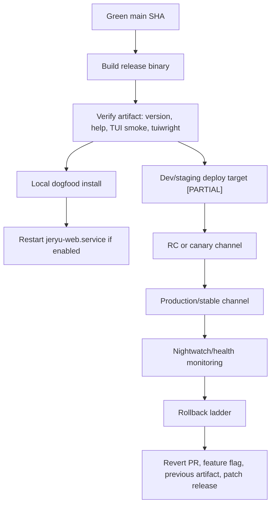

Current local deploy behavior:

- [scripts/deploy-local.sh](../scripts/deploy-local.sh) builds
  `cargo build --release -p jeryu --bin jeryu`.
- It installs to `JERYU_INSTALL_PREFIX/bin/jeryu`, the current `which jeryu`
  directory, `~/.jeryu/bin`, `~/.local/bin`, or `/usr/local/bin`.
- It verifies version, `tui --once --demo`, and `--help`.
- It stops/restarts `jeryu-web.service` when systemd user service is enabled.

Current post-merge deploy behavior:

- GitLab: `post_merge_build_artifact` builds and verifies the artifact on
  `main`; `post_merge_deploy` is manual and requires `ENABLE_HOST_DEPLOY=1`.
- GitHub: `post-merge-deploy.yml` runs after the `Rust` workflow completes
  green on `main`, rebuilds the artifact at the triggering SHA, runs TUI proof,
  uploads the binary, and optionally deploys on a `jeryu-deploy-target` runner.

Production/canary behavior:

- [src/engine_webhook_pipeline.rs](../src/engine_webhook_pipeline.rs) watches
  pipeline events. A successful `main` pipeline can launch canary work or
  production promotion checks through release lifecycle functions.
- [src/release/full_path.rs](../src/release/full_path.rs) models the complete
  source branch -> MR -> CI -> risk gate -> merge -> GitHub handoff ->
  production promotion -> install -> health path.
- The target architecture from [docs/release-policy.md](release-policy.md) is
  snapshot -> dogfood -> RC/canary -> stable, with rollback declared before
  stable promotion.

## Release Flow

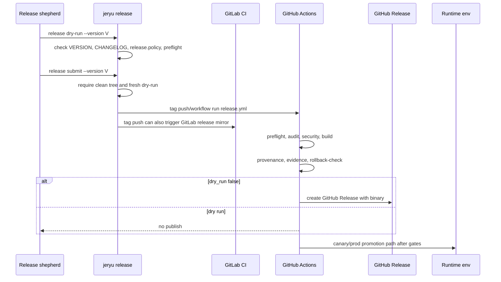

Release gate receipts required by [src/release/gate.rs](../src/release/gate.rs):

| Receipt ID | Meaning |
|---|---|
| `intake` | Issue/task linked, PR/MR template complete, agent disclosure present. |
| `vti-plan` | VTI plan emitted and tied to source/base/head. |
| `proof-receipt` | Required proof lanes passed. |
| `risk-gate` | Capability/risk gate accepted the change. |
| `reviewer-agent` | Advisory reviewer agent ran. |
| `rollback-plan` | Rollback plan declared or justified as not required. |
| `ci-checks` | Underlying CI workflows green for HEAD. |

Important current distinction:

- GitHub `release-ready.yml` posts the `jeryu/release-ready` check because it
  uses `JERYU_EMIT_STATUS=1`.
- GitLab `.gitlab-ci.yml:release_ready` rehearses the same lane with
  `JERYU_EMIT_STATUS=0`.

## Agent Plug-In Map

Agents should be drawn as bounded workers connected to JeRyu surfaces, not as
unbounded shell scripts.

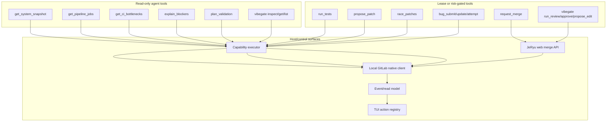

### Capability/MCP Tools

The MCP catalog in [src/mcp/tools.rs](../src/mcp/tools.rs) maps directly onto
capability intents. Use these as diagram labels for external agent plug-ins.

| Tool | Mutation | Purpose | Safety note |
|---|---:|---|---|
| `fetch_capsule` | No | Fetch latest structured failure capsule for a job. | Read-only. |
| `get_system_snapshot` | No | System state summary. | Read-only. |
| `get_pipeline_jobs` | No | Fetch jobs for a pipeline. | Read-only. |
| `get_ci_bottlenecks` | No | Historical bottlenecks. | Read-only. |
| `explain_blockers` | No | Explain job/release/merge blockers. | Read-only. |
| `plan_validation` | No | Validate proposed test plan. | Read-only. |
| `run_tests` | Yes | Create ephemeral branch and trigger CI. | Risk tier R2. |
| `propose_patch` | Yes | Create branch, commit patch, open MR. | Risk tier R3, records grant. |
| `race_patches` | Yes | Parallel hypotheses. | Risk tier R3, branch-isolated. |
| `request_merge` | Yes | Ask merge risk gate to evaluate/merge. | Risk tier R4. |
| `bug_submit`, `bug_update`, `bug_record_attempt` | Yes | Local bug workflow. | Local state mutation. |

Autonomy descriptors in [src/autonomy/mcp_tools.rs](../src/autonomy/mcp_tools.rs):

| Tool | Status | Purpose |
|---|---:|---|
| `vibegate.inspect_autonomy_pack` | `[PLANNED/PARTIAL]` | Read parsed `.jeryu/autonomy` policy bundle. |
| `vibegate.get_evidence_pack` | `[PLANNED/PARTIAL]` | Fetch evidence pack. |
| `vibegate.get_verdict` | `[PLANNED/PARTIAL]` | Fetch verdict. |
| `vibegate.list_receipts` | `[PLANNED/PARTIAL]` | List approval receipts. |
| `vibegate.get_agent_health` | `[PLANNED/PARTIAL]` | Agent health and latency. |
| `vibegate.doctor` | `[PLANNED/PARTIAL]` | Provider health sweep. |
| `vibegate.run_review` | `[PLANNED]` | Lease-gated reviewer call. |
| `vibegate.approve_mr` | `[PLANNED]` | Lease-gated SHA-bound approval. |
| `vibegate.propose_autonomy_edit` | `[PLANNED]` | Open MR for autonomy policy changes. |

### Agent Roles by Flow Stage

| Stage | Agent role | Allowed action |
|---|---|---|
| Intent intake | Planner/triage | Classify issue, risk tier, scope, proof plan. |
| Branch creation | Authoring agent | Create branch through local git/access contract. |
| Patch authoring | Coding agent | Commit to non-protected branch, produce capsule. |
| Test planning | VTI agent | Select proof lanes and test filters. |
| MR CI | CI healer | Inspect failed jobs, propose patch or rerun through JeRyu. |
| Evidence | Evidence binder | Verify capsule, receipts, command proof, rollback. |
| Review | Security/runtime/test-integrity/lockfile reviewers | Advisory comments, no self-approval. |
| Judge | Merge Passport judge | Fuse receipts and blockers into pass/blocked. |
| Merge | Merge steward | Request SHA-fenced merge through JeRyu API. |
| Mirror | Mirror steward | Monitor intent queue and PR fallback. |
| Main CI | Mainline watcher | Diagnose regressions and stale artifacts. |
| Release | Release shepherd | Run dry-run, prepare tag request, verify release evidence. |
| Deploy | Deploy steward | Promote artifact, monitor health, trigger rollback path when allowed. |
| TUI | Operator assistant | Suggest safe next actions, never bypass gates. |

## TUI and Event Visibility

The TUI should be drawn as a read-model consumer, not as the source of truth.

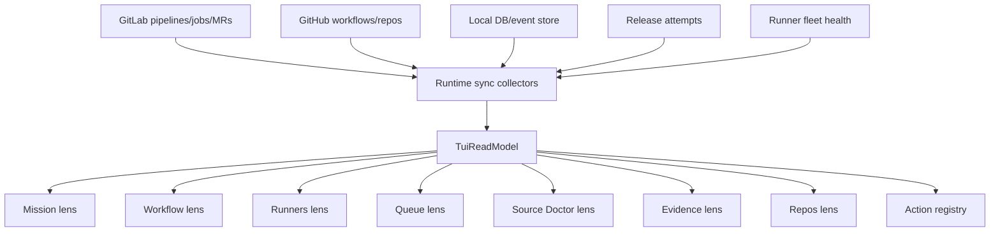

Relevant TUI/current modules:

| Surface | Source | What it should show |
|---|---|---|
| Mission | `src/tui/lenses/mission/*`, read model | Overall source/proof health, attention queue, next actions. |
| Workflow | `src/tui/workflow/delivery/*`, `src/tui/lenses/workflow/delivery/*` | MR -> CI -> agent review -> auto-merge -> post-merge -> promotion graph. |
| Runners | `src/tui/lenses/runners/*` | Active/total runners now; in-flight U22 should show per-node state, stale/partial/orphan/drift. |
| Queue | `src/tui/lenses/queue/*` | Queue depth, running/failed jobs, whether adding runners helps. |
| Source Doctor | `src/tui/lenses/source_doctor/*` | Source freshness, degraded sources, schema/action/MCP drift. |
| Evidence | `src/tui/lenses/evidence/*` | Evidence graph and bundle lineage. |
| Actions | `src/tui/action_registry_entries.rs` | Safe commands and risk tier metadata. |

Event taxonomy in [src/api/events.rs](../src/api/events.rs) currently covers
system, pipeline, job, log, test, agent, grants, cache, release, security, and
action lifecycle. Runner-specific events are in flight in a companion MR and
should be shown as a dashed extension in diagrams until merged.

## Branch and Mainline Safety Rules

Draw these as hard gates around any protected branch:

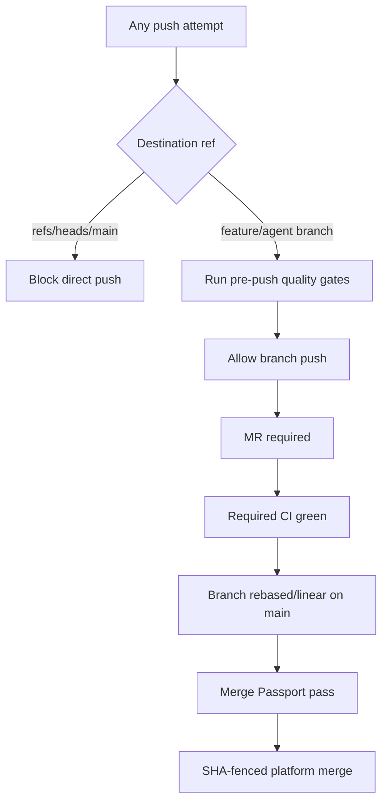

Current enforcement points:

- Local hooks block direct pushes to `refs/heads/main`.
- Release policy says `main` is protected, linear, no force-push, and no direct
  agent push.
- GitLab merge is fenced by expected SHA.
- JeRyu access contract is the intended source for repo setup and repair.
- CI policy should reject runner tags and direct protected-branch mutation.

Required audit points:

- Hooks installed and executable in every registered repo.
- `main` protected on local GitLab and GitHub.
- Merge requests required.
- Linear history and rebase-before-merge required.
- Required status checks configured.
- No raw local GitLab HTTP origin.
- No CI job pushes directly to protected `main`.
- No `tags:` runner affinity in standard CI unless explicitly exempted.

## Failure and Recovery Paths

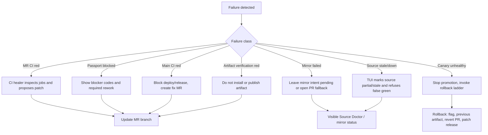

Recovery rules:

- A partial health probe must not become green. It should produce degraded
  output with missing source labels.
- A mirror transient failure should be retried or surfaced, not consumed as
  success.
- Artifact verification failure must block install/publish.
- Canary failure must stop production promotion.
- Release rollback must leave stable history intact.

## Implementation Gaps and Diagram Warnings

These are important to show as red or dashed edges in a future diagram.

| Gap | Current evidence | Diagram treatment |
|---|---|---|
| GitLab Jankurai/source-auth fail-open lanes | `.gitlab-ci.yml` has `allow_failure: true` for several safety lanes. | Red "fail-open" badge until policy slice lands. |
| GitHub README media direct push | `rust.yml` commits and pushes README media on `main`. | Red side-effect edge; target is MR/artifact path. |
| Merge Passport stubs | `merge_gate.rs` stubs approvals, CODEOWNERS, VTI, signed evidence, branch protection, freeze. | Solid for implemented gates, dashed for stubs. |
| Mirror consumer | Producer exists/in-flight; consumer is not part of this root source unless companion MR merged. | Dashed post-merge mirror edge. |
| GitLab release_ready status posting | GitLab lane uses `JERYU_EMIT_STATUS=0`. | Label as rehearsal, not status publisher. |
| Post-merge deploy | GitLab deploy is manual and variable-gated; GitHub deploy target is optional and `continue-on-error`. | Manual/optional badge. |
| Runner/live fleet health | Runners lens has summary selectors; full per-node drift/orphan UI is in flight. | Summary current, detailed pane dashed. |

## Diagram Extraction Checklist

When converting this into a visual diagram:

1. Use one color per plane: local workspace, local GitLab, JeRyu control plane,
   GitHub, artifact store, runtime environment.
2. Use solid edges for `[CURRENT]`, dashed edges for `[IN-FLIGHT]` and
   `[PLANNED]`, and red edges for `[ANTI-PATTERN]`.
3. Label every mutating edge with its safety fence: hook, lease, risk tier,
   exact SHA, idempotency key, branch protection, or manual environment.
4. Keep GitLab and GitHub separate. Do not draw GitHub as the source of local
   agent truth.
5. Draw the TUI as a consumer of the read model and event store, not as a
   direct mutator.
6. Put artifacts on their own rail so binary, SBOM, evidence, screenshots,
   and web outputs can be traced from source SHA to release.
7. Show all blocked/failure paths. A diagram that only shows green flow hides
   the most important autonomy behavior.
8. Mark every agent plug-in as read-only, preview, or execute.
9. Add a prominent "No raw local GitLab API / no glab / no token loops" guard
   around agent surfaces.
10. Show the post-merge mirror intent queue as append-only, with retry and PR
    fallback.

## Minimal Data Model for a Future Diagram Generator

The following model is sufficient to generate a graph from this document.

```toml
[[node]]
id = "D5"
label = "GitLab MR CI"
plane = "local_gitlab"
status = "current"
source = ".gitlab-ci.yml"

[[edge]]
from = "D5"
to = "D7"
label = "CI/evidence feeds Merge Passport"
mutation = false
guard = "pipeline success plus receipts"

[[artifact]]
id = "target_release_jeryu"
label = "target/release/jeryu"
producer = "ops/ci/post-merge-deploy-lane.sh build"
consumer = ["local_dogfood", "release_publish", "deploy_target"]

[[agent_plugin]]
id = "propose_patch"
surface = "mcp_capability"
mutation = true
risk_tier = "R3"
allowed_stage = "branch_before_mr"
```

## Short Critical Path

For a compact executive diagram, collapse the graph to this:

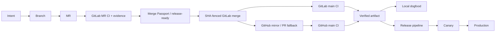

## Expanded Critical Path With Agents

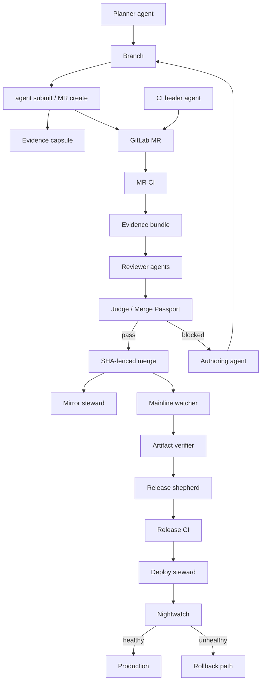

